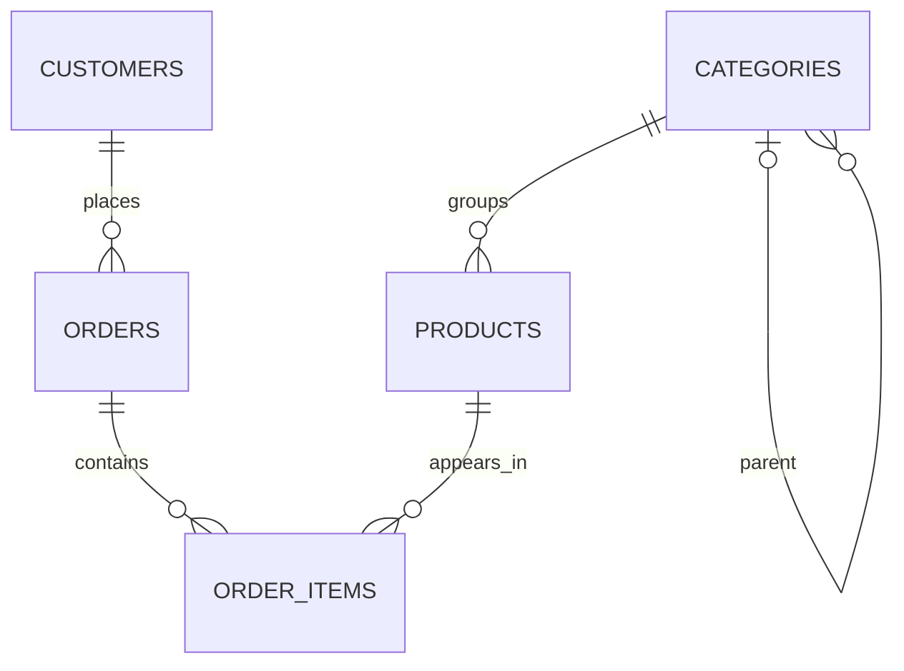

# PostgreSQL and SQL revision: learn by doing

[Back to the topic index](./README.md)

A practical reference with copy-paste SQL, an Ubuntu setup and short experiments. Use the same small practice database throughout. All data is synthetic.

**SQL** is the query language. **PostgreSQL** is the database system. **psql** is its command-line client. **pnpm** manages the optional Node.js integration; PostgreSQL itself is installed separately.

The core SQL uses PostgreSQL 14+ syntax. Use a supported PostgreSQL release and documentation matching your installed major version. Version-specific examples are labelled.

## Practice workflow

1. Complete the Ubuntu/database setup in section 1.
2. Create the practice tables and seed data in section 3.
3. Paste a section's SQL into `psql`, or save it in a `.sql` file.
4. Read the result, change one expression and rerun it.
5. Most write labs use `BEGIN` and `ROLLBACK` so the seed rows remain unchanged.

Run the examples against the dedicated **`revision_db`** database. SQL fences run in psql; Bash fences run in your Ubuntu terminal. Backslash commands such as `\dt` are psql commands, not server SQL.

Blocks marked **Expected error** demonstrate rejected input. Run them individually in an idle psql session. If an error occurs inside a transaction, use `ROLLBACK;` before continuing. A file run with `ON_ERROR_STOP=1` stops at the first error.

## Contents

- [PostgreSQL and SQL revision: learn by doing](#postgresql-and-sql-revision-learn-by-doing)
  - [Practice workflow](#practice-workflow)
  - [Contents](#contents)
  - [1. Ubuntu setup and a practice database](#1-ubuntu-setup-and-a-practice-database)
    - [Install the Ubuntu packages](#install-the-ubuntu-packages)
    - [Create the role and database once](#create-the-role-and-database-once)
    - [Create the local project folder](#create-the-local-project-folder)
  - [2. psql essentials](#2-psql-essentials)
  - [3. Practice schema and seed data](#3-practice-schema-and-seed-data)
    - [Reset only the practice schema](#reset-only-the-practice-schema)
  - [4. Types, keys and constraints](#4-types-keys-and-constraints)
  - [5. SELECT, filtering and sorting](#5-select-filtering-and-sorting)
  - [6. NULL, CASE and defaults](#6-null-case-and-defaults)
  - [7. INSERT, UPDATE, DELETE and RETURNING](#7-insert-update-delete-and-returning)
  - [8. Upsert with ON CONFLICT](#8-upsert-with-on-conflict)
  - [9. Joins and relationships](#9-joins-and-relationships)
  - [10. Aggregates, GROUP BY and HAVING](#10-aggregates-group-by-and-having)
  - [11. Subqueries, EXISTS and NOT EXISTS](#11-subqueries-exists-and-not-exists)
  - [12. CTEs and set operations](#12-ctes-and-set-operations)
  - [13. Window functions](#13-window-functions)
  - [14. Offset and keyset pagination](#14-offset-and-keyset-pagination)
  - [15. Text, numbers and dates](#15-text-numbers-and-dates)
  - [16. JSONB, arrays and LATERAL](#16-jsonb-arrays-and-lateral)
  - [17. Transactions and savepoints](#17-transactions-and-savepoints)
  - [18. Concurrency, locks and isolation](#18-concurrency-locks-and-isolation)
  - [19. Recursive CTEs](#19-recursive-ctes)
  - [20. Views and materialized views](#20-views-and-materialized-views)
  - [21. Functions and triggers](#21-functions-and-triggers)
  - [22. Indexes and EXPLAIN](#22-indexes-and-explain)
  - [23. Schema changes and migrations](#23-schema-changes-and-migrations)
  - [24. Roles and privileges](#24-roles-and-privileges)
  - [25. Maintenance, CSV and backups](#25-maintenance-csv-and-backups)
    - [Vacuum and statistics](#vacuum-and-statistics)
    - [CSV export and import](#csv-export-and-import)
    - [Backup and restore exercise](#backup-and-restore-exercise)
  - [26. Node.js integration with pnpm](#26-nodejs-integration-with-pnpm)
  - [27. Atomic checkout practice](#27-atomic-checkout-practice)
  - [28. Mistakes, study order and challenges](#28-mistakes-study-order-and-challenges)
    - [Common mistakes](#common-mistakes)
    - [Suggested study order](#suggested-study-order)
    - [Practice challenges](#practice-challenges)
    - [Mental checklist](#mental-checklist)
  - [Official references](#official-references)

## 1. Ubuntu setup and a practice database

**What it does:** installs PostgreSQL, creates a local login role and gives it a dedicated database.

### Install the Ubuntu packages

If PostgreSQL is already installed, check the existing service and version first.

```bash
sudo apt update
sudo apt install postgresql postgresql-client
sudo systemctl enable --now postgresql
pg_lsclusters
psql --version
```

Ubuntu's repositories provide a PostgreSQL major version appropriate to that Ubuntu release. For a different supported major, follow the [official PostgreSQL Ubuntu repository instructions](https://www.postgresql.org/download/linux/ubuntu/).

`psql --version` identifies the client; the connected server can have a different version. `pg_lsclusters` shows local clusters and their ports. These examples use port **5432**; substitute the actual port if yours differs.

### Create the role and database once

Open the administrative psql session:

```bash
sudo -u postgres psql -p 5432
```

Run this **SQL**:

```sql
CREATE ROLE revision_user
  LOGIN NOSUPERUSER NOCREATEDB NOCREATEROLE;
```

Set a password interactively, keeping it out of SQL files and shell history:

```text
\password revision_user
```

Then run:

```sql
CREATE DATABASE revision_db OWNER revision_user;
```

Exit:

```text
\q
```

`CREATE DATABASE` runs outside a transaction. If the role/database already exists, reuse it instead of rerunning creation.

Connect as the practice role over local TCP:

```bash
psql -X -h 127.0.0.1 -p 5432 -U revision_user -d revision_db
```

Enter the password when prompted. Ubuntu commonly uses peer authentication for local Unix sockets; `-h 127.0.0.1` selects TCP and the matching host authentication rule.

**Verify in psql:**

```sql
SELECT current_database(), current_user, version();
SHOW server_version;
SHOW TimeZone;
```

**Expected:** database `revision_db` and role `revision_user`. The role owns this practice database without superuser or role-creation privileges.

### Create the local project folder

In a separate terminal:

```bash
mkdir -p postgresql-revision
cd postgresql-revision
mkdir -p sql scripts backups
```

Keep this terminal in the project root for the remaining commands.

## 2. psql essentials

**What it does:** helps you inspect objects and execute saved SQL.

Run these **psql commands** one at a time:

```text
\conninfo
\l
\dn
\dt revision.*
\d revision.products
\x auto
\timing on
\?
```

`\dt` and `\d` become useful after section 3 creates the tables.

| Command                | Purpose                                             |
| ---------------------- | --------------------------------------------------- |
| `\conninfo`            | Show connection details                             |
| `\l`                   | List databases                                      |
| `\dn`                  | List schemas                                        |
| `\dt revision.*`       | List tables in the practice schema                  |
| `\d revision.products` | Describe columns, constraints and indexes           |
| `\i sql/00-setup.sql`  | Execute a file relative to psql's working directory |
| `\x auto`              | Switch wide results to expanded output              |
| `\timing on`           | Show statement duration                             |
| `\q`                   | Exit psql                                           |

SQL statements end with a semicolon. Psql backslash commands normally do not.

To execute a file from your project-root terminal:

```bash
psql -X -h 127.0.0.1 -p 5432 -U revision_user -d revision_db \
  -v ON_ERROR_STOP=1 -f sql/00-setup.sql
```

`-X` ignores personal psql startup configuration. `ON_ERROR_STOP` makes a failed SQL file exit with an error rather than silently continuing.

**Try it:** save a later read-only query as `sql/lab.sql` and run it using the same command with the new filename.

## 3. Practice schema and seed data

**What it does:** creates five related tables with reproducible rows.

| Table         | Stores                                            |
| ------------- | ------------------------------------------------- |
| `customers`   | Generic customer codes and regions                |
| `categories`  | A parent/child category hierarchy                 |
| `products`    | Catalog price, stock and JSON attributes          |
| `orders`      | Customer, order status and timestamp              |
| `order_items` | Quantity and the unit price captured for an order |



An order can temporarily have no items; each item belongs to exactly one order and one product.

**File: `sql/00-setup.sql`**

Run this file once in `revision_db`.

```sql
BEGIN;

CREATE SCHEMA revision;

CREATE TABLE revision.customers (
  id integer GENERATED ALWAYS AS IDENTITY PRIMARY KEY,
  code text NOT NULL UNIQUE,
  label text NOT NULL CHECK (length(trim(label)) > 0),
  region text NOT NULL CHECK (region IN ('north', 'south', 'west'))
);

CREATE TABLE revision.categories (
  id integer GENERATED ALWAYS AS IDENTITY PRIMARY KEY,
  label text NOT NULL UNIQUE,
  parent_id integer REFERENCES revision.categories(id),
  CHECK (parent_id IS NULL OR parent_id <> id)
);

CREATE TABLE revision.products (
  id integer GENERATED ALWAYS AS IDENTITY PRIMARY KEY,
  sku text NOT NULL UNIQUE,
  title text NOT NULL CHECK (length(trim(title)) > 0),
  category_id integer NOT NULL REFERENCES revision.categories(id),
  price numeric(10, 2) NOT NULL CHECK (price > 0),
  stock integer NOT NULL DEFAULT 0 CHECK (stock >= 0),
  active boolean NOT NULL DEFAULT true,
  attributes jsonb NOT NULL DEFAULT '{}'::jsonb
    CHECK (jsonb_typeof(attributes) = 'object'),
  updated_at timestamptz NOT NULL DEFAULT now()
);

CREATE TABLE revision.orders (
  id integer GENERATED ALWAYS AS IDENTITY PRIMARY KEY,
  customer_id integer NOT NULL REFERENCES revision.customers(id),
  status text NOT NULL DEFAULT 'pending'
    CHECK (status IN ('pending', 'paid', 'shipped', 'cancelled')),
  coupon_code text,
  created_at timestamptz NOT NULL DEFAULT now()
);

CREATE TABLE revision.order_items (
  order_id integer NOT NULL REFERENCES revision.orders(id) ON DELETE CASCADE,
  product_id integer NOT NULL REFERENCES revision.products(id),
  quantity integer NOT NULL CHECK (quantity > 0),
  unit_price numeric(10, 2) NOT NULL CHECK (unit_price >= 0),
  PRIMARY KEY (order_id, product_id)
);

INSERT INTO revision.customers (code, label, region) VALUES
  ('C001', 'Demo Alpha', 'north'),
  ('C002', 'Demo Beta', 'south'),
  ('C003', 'Demo Gamma', 'north'),
  ('C004', 'Demo Delta', 'west');

INSERT INTO revision.categories (label, parent_id) VALUES
  ('Office', NULL),
  ('Stationery', 1),
  ('Electronics', NULL),
  ('Accessories', 3);

INSERT INTO revision.products
  (sku, title, category_id, price, stock, active, attributes)
VALUES
  ('PEN-01', 'Pen', 2, 2.50, 100, true,
   '{"color":"blue","tags":["writing","budget"]}'),
  ('BOOK-01', 'Notebook', 2, 8.00, 40, true,
   '{"size":"A5","tags":["paper"]}'),
  ('MOUSE-01', 'Mouse', 4, 25.00, 15, true,
   '{"wireless":true,"tags":["usb"]}'),
  ('KEY-01', 'Keyboard', 3, 45.00, 10, true,
   '{"wireless":false,"tags":["usb"]}'),
  ('STAND-01', 'Monitor stand', 1, 30.00, 0, false, '{}');

INSERT INTO revision.orders
  (customer_id, status, coupon_code, created_at)
VALUES
  (1, 'paid', NULL, '2025-01-01 10:00:00+00'),
  (1, 'shipped', 'WELCOME', '2025-01-03 10:00:00+00'),
  (2, 'paid', NULL, '2025-01-04 10:00:00+00'),
  (3, 'cancelled', NULL, '2025-01-05 10:00:00+00'),
  (2, 'pending', 'BULK', '2025-01-06 10:00:00+00');

INSERT INTO revision.order_items (order_id, product_id, quantity, unit_price)
VALUES
  (1, 1, 4, 2.50), (1, 2, 2, 8.00),
  (2, 3, 1, 25.00), (2, 4, 1, 45.00),
  (3, 2, 3, 8.00), (3, 1, 2, 2.50),
  (4, 3, 1, 25.00),
  (5, 4, 2, 45.00);

COMMIT;
```

**Run from the project root:**

```bash
psql -X -h 127.0.0.1 -p 5432 -U revision_user -d revision_db \
  -v ON_ERROR_STOP=1 -f sql/00-setup.sql
```

**Verify:**

```sql
SELECT
  (SELECT count(*) FROM revision.customers) AS customers,
  (SELECT count(*) FROM revision.categories) AS categories,
  (SELECT count(*) FROM revision.products) AS products,
  (SELECT count(*) FROM revision.orders) AS orders,
  (SELECT count(*) FROM revision.order_items) AS items;
```

**Expected:** `4, 4, 5, 5, 8`.

Queries use schema-qualified table names, so they work without changing `search_path`. Customers and products are stored once and referenced through keys. Order items form the many-to-many relationship between orders and products. Their captured prices describe the sale at that time; they are separate facts from current catalog prices.

### Reset only the practice schema

This removes all objects/data in `revision`, including any optional views or functions. The database-name check prevents this reset block from running in a differently named database.

```sql
DO $$
BEGIN
  IF current_database() <> 'revision_db' THEN
    RAISE EXCEPTION 'Reset is allowed only in revision_db';
  END IF;
  EXECUTE 'DROP SCHEMA IF EXISTS revision CASCADE';
END;
$$;
```

Then rerun `sql/00-setup.sql`. Identity counters restart because the tables are recreated.

## 4. Types, keys and constraints

**What it does:** makes the database reject invalid rows and demonstrates a generated value.

| Type/constraint      | Typical use                                   |
| -------------------- | --------------------------------------------- |
| `integer` / `bigint` | Whole numbers; bigint has a larger range      |
| `numeric(p, s)`      | Exact decimal values                          |
| `double precision`   | Approximate floating-point values             |
| `text` / `boolean`   | Text and true/false                           |
| `date`               | Calendar date                                 |
| `timestamptz`        | An instant displayed in the session time zone |
| `uuid`               | UUID identifier                               |
| `jsonb`              | Queryable JSON data                           |
| `PRIMARY KEY`        | Unique, non-null row identity                 |
| `FOREIGN KEY`        | Referenced row must exist                     |
| `UNIQUE`             | Prevent duplicate key values                  |
| `NOT NULL` / `CHECK` | Presence and row-level validity               |

```sql
BEGIN;

CREATE TEMP TABLE line_demo (
  quantity integer NOT NULL CHECK (quantity > 0),
  unit_price numeric(10, 2) NOT NULL CHECK (unit_price >= 0),
  total numeric(12, 2)
    GENERATED ALWAYS AS (quantity * unit_price) STORED
);

INSERT INTO line_demo (quantity, unit_price) VALUES (3, 2.50);
SELECT * FROM line_demo; -- total = 7.50

ROLLBACK;
```

**Expected error — run separately:**

```sql
INSERT INTO revision.products (sku, title, category_id, price, stock)
VALUES ('INVALID-01', 'Invalid product', 2, -1.00, 5);
```

**Remember:** `CHECK` permits an expression evaluating to NULL, so use `NOT NULL` when absence must be rejected. A foreign key does not automatically create an index on its referencing columns. Primary keys and unique constraints create supporting unique indexes.

By default, UNIQUE allows multiple NULL values. PostgreSQL 15+ offers `UNIQUE NULLS NOT DISTINCT` when NULL should count as a duplicate. An identity column generates values; its primary key separately enforces uniqueness.

**Try it:** test a duplicate SKU or nonexistent category ID. Delete behavior matters: order items cascade with their order, while the other foreign keys use the default NO ACTION behavior.

## 5. SELECT, filtering and sorting

**What it does:** selects columns, filters rows and establishes deterministic ordering.

```sql
SELECT id, title, price, price * 1.10 AS adjusted_price
FROM revision.products
WHERE active = true AND price BETWEEN 5 AND 30
ORDER BY price DESC, id ASC;

SELECT DISTINCT region
FROM revision.customers
ORDER BY region;

SELECT sku, title
FROM revision.products
WHERE title ILIKE '%note%'
ORDER BY id;

SELECT id, status
FROM revision.orders
WHERE status IN ('paid', 'shipped')
ORDER BY id;
```

**Expected:** Mouse and Notebook in the first query; three distinct regions; Notebook for the search; orders 1, 2 and 3 for the status filter.

**Remember:** BETWEEN includes both endpoints. LIKE uses `%` for any sequence and `_` for one character; PostgreSQL ILIKE is case-insensitive. Parenthesize mixed AND/OR conditions. Result order is unspecified without ORDER BY.

**Try it:** change AND to OR, then add parentheses and compare which products match.

## 6. NULL, CASE and defaults

**What it does:** handles missing values and classifies rows.

```sql
SELECT
  NULL = NULL AS unknown_result,
  NULL IS NULL AS is_null,
  NULL IS NOT DISTINCT FROM NULL AS null_safe_equal;

SELECT id, COALESCE(coupon_code, 'none') AS coupon
FROM revision.orders
WHERE coupon_code IS NULL
ORDER BY id;

SELECT title,
  CASE
    WHEN stock = 0 THEN 'unavailable'
    WHEN stock < 20 THEN 'low'
    ELSE 'available'
  END AS stock_band
FROM revision.products
ORDER BY id;

SELECT 10.0 / NULLIF(0, 0) AS safe_division;
```

**Expected:** NULL, true, true in the first row; orders 1, 3 and 4 have no coupon. NULLIF turns a zero divisor into NULL, producing NULL instead of a division error.

**Remember:** WHERE keeps true conditions and discards false/unknown ones. Use `IS NULL`, not `= NULL`. COALESCE chooses the first non-null value; it does not replace an empty string.

**Try it:**

```sql
SELECT
  2 NOT IN (1, NULL) AS unknown_result,
  NOT EXISTS (
    SELECT 1
    FROM (VALUES (1), (NULL::integer)) AS candidates(value)
    WHERE candidates.value = 2
  ) AS no_matching_value;
```

**Expected:** NULL versus true. NOT EXISTS avoids this NULL trap when checking whether matching rows exist.

## 7. INSERT, UPDATE, DELETE and RETURNING

**What it does:** changes rows and returns the affected data without a separate SELECT.

```sql
BEGIN;

INSERT INTO revision.customers (code, label, region)
VALUES ('C999', 'Demo Temporary', 'west')
RETURNING id, code;

UPDATE revision.products
SET price = price + 1.00
WHERE sku = 'PEN-01'
RETURNING sku, price; -- 3.50

DELETE FROM revision.customers
WHERE code = 'C999'
RETURNING code;

ROLLBACK;

SELECT price FROM revision.products WHERE sku = 'PEN-01'; -- 2.50
```

**Remember:** UPDATE/DELETE without a WHERE clause affect every matching row in the table. Inspect the predicate before running a mutation. RETURNING can give you generated IDs, changed values or deleted data.

Sequences/identity counters can advance even when a transaction rolls back. IDs need uniqueness, not gap-free numbering; always use the returned ID.

**Try it:** change the UPDATE predicate to a nonexistent SKU. The statement succeeds while affecting zero rows.

## 8. Upsert with ON CONFLICT

**What it does:** inserts a new SKU or updates the existing row atomically.

```sql
BEGIN;

INSERT INTO revision.products AS existing
  (sku, title, category_id, price, stock)
VALUES ('PEN-01', 'Pen', 2, 2.50, 5)
ON CONFLICT (sku) DO UPDATE
SET stock = existing.stock + EXCLUDED.stock
RETURNING id, sku, stock; -- stock = 105

INSERT INTO revision.customers (code, label, region)
VALUES ('C001', 'Demo Alpha', 'north')
ON CONFLICT (code) DO NOTHING
RETURNING id; -- no row returned

ROLLBACK;
```

**Remember:** the conflict target needs a suitable uniqueness rule. EXCLUDED contains the proposed new row. DO NOTHING does not automatically return the existing record.

**Try it:** use a new SKU and compare the returned row with the existing-SKU case.

## 9. Joins and relationships

**What it does:** combines related rows and preserves unmatched rows when requested.

```sql
SELECT o.id AS order_id, c.code, p.title, oi.quantity, oi.unit_price
FROM revision.orders AS o
JOIN revision.customers AS c ON c.id = o.customer_id
JOIN revision.order_items AS oi ON oi.order_id = o.id
JOIN revision.products AS p ON p.id = oi.product_id
ORDER BY o.id, p.id;

SELECT c.code, o.id AS paid_order_id
FROM revision.customers AS c
LEFT JOIN revision.orders AS o
  ON o.customer_id = c.id AND o.status IN ('paid', 'shipped')
ORDER BY c.id, o.id;

SELECT child.label, parent.label AS parent_label
FROM revision.categories AS child
LEFT JOIN revision.categories AS parent ON parent.id = child.parent_id
ORDER BY child.id;
```

**Expected:** eight item rows; every customer appears in the left join, including customers without a paid/shipped order.

| Join              | Keeps                                             |
| ----------------- | ------------------------------------------------- |
| INNER JOIN / JOIN | Matching combinations                             |
| LEFT JOIN         | All left rows, with NULL for missing right values |
| RIGHT JOIN        | All right rows                                    |
| FULL JOIN         | Matches and unmatched rows from either side       |
| CROSS JOIN        | Every left/right combination                      |
| Self join         | One table used in multiple roles                  |

**Try a full join on tiny input sets:**

```sql
SELECT COALESCE(left_side.key, right_side.key) AS key
FROM (VALUES (1), (2)) AS left_side(key)
FULL JOIN (VALUES (2), (3)) AS right_side(key)
  ON left_side.key = right_side.key
ORDER BY key;
```

**Expected:** 1, 2, 3.

**Remember:** placing `o.status = 'paid'` in WHERE after a LEFT JOIN removes rows where the right side is NULL. Put the filter in ON when unmatched customers should remain.

## 10. Aggregates, GROUP BY and HAVING

**What it does:** calculates summaries and filters whole groups.

```sql
SELECT
  count(*) AS product_count,
  sum(stock) AS total_stock,
  round(avg(price), 2) AS average_price
FROM revision.products;

SELECT c.code,
  count(DISTINCT o.id) AS order_count,
  COALESCE(
    sum(oi.quantity * oi.unit_price)
      FILTER (WHERE o.status IN ('paid', 'shipped')),
    0
  ) AS paid_total
FROM revision.customers AS c
LEFT JOIN revision.orders AS o ON o.customer_id = c.id
LEFT JOIN revision.order_items AS oi ON oi.order_id = o.id
GROUP BY c.id, c.code
ORDER BY c.id;

SELECT o.customer_id, sum(oi.quantity * oi.unit_price) AS paid_total
FROM revision.orders AS o
JOIN revision.order_items AS oi ON oi.order_id = o.id
WHERE o.status IN ('paid', 'shipped')
GROUP BY o.customer_id
HAVING sum(oi.quantity * oi.unit_price) > 40
ORDER BY o.customer_id;
```

**Expected:** product count 5, total stock 165, average price 22.10. Paid totals are 96.00, 29.00, 0 and 0; HAVING retains customer 1.

**Remember:** WHERE filters rows before grouping; HAVING filters groups. COUNT(\*) counts rows; COUNT(column) skips NULL. SUM over no inputs returns NULL. Joining orders to items repeats an order for each item, so use the correct aggregation grain.

For reasoning about a query, the usual logical order is FROM/JOIN → WHERE → GROUP BY → HAVING → SELECT → DISTINCT → ORDER BY → LIMIT. This explains why a SELECT alias is usually unavailable in WHERE. It is separate from the optimizer's physical execution plan.

**Try it:** replace `count(DISTINCT o.id)` with `count(o.id)` and explain the inflated order counts.

## 11. Subqueries, EXISTS and NOT EXISTS

**What it does:** compares rows with a calculated value and checks whether related rows exist.

```sql
SELECT title, price
FROM revision.products
WHERE price > (SELECT avg(price) FROM revision.products)
ORDER BY price, id;

SELECT c.code
FROM revision.customers AS c
WHERE EXISTS (
  SELECT 1 FROM revision.orders AS o WHERE o.customer_id = c.id
)
ORDER BY c.id;

SELECT p.sku
FROM revision.products AS p
WHERE NOT EXISTS (
  SELECT 1 FROM revision.order_items AS oi WHERE oi.product_id = p.id
)
ORDER BY p.id;
```

**Expected:** Mouse, Monitor stand and Keyboard are above average; C001–C003 have orders; STAND-01 has no order items.

**Remember:** EXISTS checks for at least one matching row and does not multiply outer rows. A scalar subquery must produce at most one row. NOT EXISTS is useful for missing relationships.

**Try it:** find customers with no orders using NOT EXISTS.

## 12. CTEs and set operations

**What it does:** names an intermediate result and combines compatible result sets.

```sql
WITH order_totals AS (
  SELECT o.id, o.status, sum(oi.quantity * oi.unit_price) AS total
  FROM revision.orders AS o
  JOIN revision.order_items AS oi ON oi.order_id = o.id
  GROUP BY o.id, o.status
)
SELECT sum(total) AS paid_total
FROM order_totals
WHERE status IN ('paid', 'shipped'); -- 125.00

SELECT region FROM revision.customers WHERE id <= 2
UNION
SELECT region FROM revision.customers WHERE id >= 2
ORDER BY region;

SELECT id FROM revision.customers
EXCEPT
SELECT customer_id FROM revision.orders
ORDER BY id; -- 4

SELECT id FROM revision.customers WHERE region = 'north'
INTERSECT
SELECT customer_id FROM revision.orders WHERE status = 'paid'
ORDER BY id; -- 1
```

| Operator  | Meaning                                   |
| --------- | ----------------------------------------- |
| UNION     | Combine results and remove duplicate rows |
| UNION ALL | Combine results and preserve duplicates   |
| INTERSECT | Rows present in both results              |
| EXCEPT    | Left rows absent from the right result    |

**Remember:** set-operation inputs need matching column counts and compatible types. CTEs improve readability; they do not automatically make queries faster. PostgreSQL can inline some CTEs; MATERIALIZED/NOT MATERIALIZED influence suitable cases.

**Try it:** replace UNION with UNION ALL and count the repeated regions.

## 13. Window functions

**What it does:** calculates ranks, previous values and running totals without collapsing result rows.

```sql
WITH totals AS (
  SELECT o.id, o.created_at, sum(oi.quantity * oi.unit_price) AS total
  FROM revision.orders AS o
  JOIN revision.order_items AS oi ON oi.order_id = o.id
  GROUP BY o.id, o.created_at
)
SELECT id, total,
  dense_rank() OVER (ORDER BY total DESC) AS value_rank,
  lag(total) OVER (ORDER BY created_at, id) AS previous_total,
  sum(total) OVER (
    ORDER BY created_at, id
    ROWS BETWEEN UNBOUNDED PRECEDING AND CURRENT ROW
  ) AS running_total
FROM totals
ORDER BY created_at, id;

WITH ranked_products AS (
  SELECT category_id, title, price,
    row_number() OVER (
      PARTITION BY category_id ORDER BY price DESC, id
    ) AS position
  FROM revision.products
  WHERE active
)
SELECT category_id, title, price
FROM ranked_products
WHERE position = 1
ORDER BY category_id;
```

**Expected:** running totals 26, 96, 125, 150, 240 for all five orders, including pending/cancelled ones. The second query returns the highest-priced active product in each represented category.

**Remember:** ROW_NUMBER assigns consecutive row numbers; RANK leaves gaps after ties; DENSE_RANK does not. PARTITION BY restarts calculations per group. The explicit ROWS frame makes the running total's intent clear.

**Try it:** filter the first query's CTE to paid/shipped orders. Change the final ORDER BY and observe that display order and window calculation order are separate.

## 14. Offset and keyset pagination

**What it does:** returns a stable slice or continues after a cursor.

```sql
SELECT id, title
FROM revision.products
ORDER BY id
LIMIT 2 OFFSET 2; -- IDs 3, 4

SELECT id, title
FROM revision.products
WHERE id > 2
ORDER BY id
LIMIT 2; -- IDs 3, 4

SELECT id, created_at
FROM revision.orders
WHERE (created_at, id) >
  (TIMESTAMPTZ '2025-01-03 10:00:00+00', 2)
ORDER BY created_at, id
LIMIT 2; -- IDs 3, 4
```

**Remember:** a unique tie-breaker makes order deterministic. Large OFFSET values still require skipping preceding rows. Keyset pagination needs cursor fields matching the filtering and ordering, plus a suitable index.

**Try it:** reverse the sort. A descending keyset cursor normally uses `<` instead of `>`. Separate page requests can still observe concurrent data changes.

## 15. Text, numbers and dates

**What it does:** transforms text, casts values and queries timestamps with clear boundaries.

```sql
SELECT
  lower('SQL Practice') AS lower_text,
  trim('  database  ') AS trimmed,
  length('Notebook') AS characters,
  replace('sql-basics', '-', ' ') AS replaced;

SELECT
  5 / 2 AS integer_division,
  5.0 / 2 AS decimal_division,
  round('12.345'::numeric, 2) AS rounded;

SET TIME ZONE 'UTC';

SELECT id,
  date_trunc('day', created_at) AS day_start,
  created_at AT TIME ZONE 'UTC' AS utc_wall_time
FROM revision.orders
ORDER BY id;

SELECT id, created_at
FROM revision.orders
WHERE created_at >= TIMESTAMPTZ '2025-01-03 00:00:00+00'
  AND created_at < TIMESTAMPTZ '2025-01-05 00:00:00+00'
ORDER BY id; -- IDs 2, 3

SELECT
  DATE '2025-01-01' + INTERVAL '7 days' AS next_week,
  now() AS transaction_time,
  statement_timestamp() AS statement_time,
  clock_timestamp() AS current_clock;
```

**Remember:** integer division truncates; cast or use decimal operands when needed. Timestamptz stores an instant, not the original time-zone name. A timestamp without time zone stores wall-clock fields.

Half-open ranges (`>= start AND < end`) avoid guessing the day's last fractional second. They can also use a normal timestamp index without wrapping the indexed column in a function.

Single quotes delimit strings; double quotes delimit identifiers. Unquoted identifiers fold to lowercase.

**Try it:** switch the session time zone and rerun the display query. The stored instant remains the same. `now()` stays fixed within a transaction; `clock_timestamp()` can change.

## 16. JSONB, arrays and LATERAL

**What it does:** reads structured attributes and expands nested values into rows.

```sql
SELECT sku,
  attributes -> 'tags' AS tags_json,
  attributes ->> 'wireless' AS wireless_text
FROM revision.products
ORDER BY id;

SELECT sku
FROM revision.products
WHERE attributes @> '{"wireless":true}'::jsonb; -- MOUSE-01

SELECT sku
FROM revision.products
WHERE attributes ? 'color'; -- PEN-01

SELECT p.sku, tag.value AS tag
FROM revision.products AS p
LEFT JOIN LATERAL jsonb_array_elements_text(
  COALESCE(p.attributes -> 'tags', '[]'::jsonb)
) AS tag(value) ON true
ORDER BY p.id, tag.value;

SELECT
  ARRAY['sql', 'postgres', 'node'] AS topics,
  cardinality(ARRAY['sql', 'postgres', 'node']) AS topic_count,
  'sql' = ANY(ARRAY['sql', 'postgres', 'node']) AS contains_sql;
```

**Expected:** six rows in the LATERAL query: two Pen tags, one each for Notebook/Mouse/Keyboard, and a NULL tag for Monitor stand.

**Remember:** `->` returns JSON; `->>` returns text. JSONB containment uses `@>` and key existence uses `?`. LATERAL lets a FROM expression refer to preceding FROM items. The left join preserves a product without tags.

JSONB is useful for flexible attributes; core relational keys and relationships still belong in typed columns/constraints. SQL arrays are a different data type from JSON arrays.

**Try it:** find products whose attributes contain `{"tags":["usb"]}`.

## 17. Transactions and savepoints

**What it does:** groups changes and rolls back only part of a transaction.

```sql
BEGIN;

UPDATE revision.products
SET stock = stock - 5
WHERE sku = 'PEN-01' AND stock >= 5
RETURNING stock; -- 95

SAVEPOINT price_edit;

UPDATE revision.products
SET price = price + 1.00
WHERE sku = 'PEN-01';

ROLLBACK TO SAVEPOINT price_edit;

SELECT stock, price
FROM revision.products
WHERE sku = 'PEN-01'; -- 95, 2.50

ROLLBACK;

SELECT stock, price
FROM revision.products
WHERE sku = 'PEN-01'; -- 100, 2.50
```

**Remember:** COMMIT keeps the transaction's changes; ROLLBACK discards them. After a statement error, the transaction is aborted until you roll back the transaction or an appropriate savepoint.

A conditional UPDATE returns no row if the stock condition fails. Application code must check that result before creating an order. Avoid holding a transaction open while waiting for user input or unrelated network calls.

**Try it:** change the decrement and condition to 500. The UPDATE should affect zero rows.

## 18. Concurrency, locks and isolation

**What it does:** shows a row lock and the difference between locked writes and snapshot reads.

Open **two actual psql sessions**, A and B, connected to the same practice database.

**Session A — keep this transaction open:**

```sql
BEGIN;

UPDATE revision.products
SET stock = stock - 1
WHERE sku = 'PEN-01';

SELECT stock FROM revision.products WHERE sku = 'PEN-01'; -- 99
```

**Session B — ordinary read:**

```sql
SELECT stock FROM revision.products WHERE sku = 'PEN-01'; -- 100
```

**Session B — expected lock error:**

```sql
SELECT id
FROM revision.products
WHERE sku = 'PEN-01'
FOR UPDATE NOWAIT;
```

NOWAIT fails immediately because session A holds the row lock. A regular FOR UPDATE would wait. Session B's statement runs in autocommit, so it does not leave an explicit transaction open.

**Session A — release the lock and undo the change:**

```sql
ROLLBACK;
```

**Session B — retry:**

```sql
SELECT id
FROM revision.products
WHERE sku = 'PEN-01'
FOR UPDATE NOWAIT;
```

**Expected:** the retry succeeds.

| Isolation level         | Snapshot/behavior                                                       |
| ----------------------- | ----------------------------------------------------------------------- |
| READ COMMITTED, default | Each statement gets a new committed snapshot                            |
| REPEATABLE READ         | Ordinary reads share a transaction snapshot; update conflicts can abort |
| SERIALIZABLE            | Adds checks for serializable execution; transactions may need retry     |

PostgreSQL treats READ UNCOMMITTED as READ COMMITTED.

**Remember:** locks are held until transaction end. Acquire multiple resources in a consistent order to reduce deadlocks. Retry the **whole transaction** for serialization failures/deadlocks when appropriate, using a bounded policy.

**Try it:** inspect the default using `SHOW transaction_isolation;`. Use `BEGIN ISOLATION LEVEL REPEATABLE READ;` for a separate experiment and end it with ROLLBACK.

## 19. Recursive CTEs

**What it does:** walks a parent/child hierarchy while tracking visited IDs.

```sql
WITH RECURSIVE category_tree AS (
  SELECT id, label, parent_id, 0 AS depth, ARRAY[id] AS path
  FROM revision.categories
  WHERE parent_id IS NULL

  UNION ALL

  SELECT child.id, child.label, child.parent_id,
    tree.depth + 1,
    tree.path || child.id
  FROM revision.categories AS child
  JOIN category_tree AS tree ON child.parent_id = tree.id
  WHERE NOT child.id = ANY(tree.path)
)
SELECT id, label, depth, path
FROM category_tree
ORDER BY path;
```

**Expected:** Office → Stationery and Electronics → Accessories. Roots have depth 0; their children have depth 1.

**Remember:** recursion needs a starting set and a termination condition. The path check prevents revisiting an ID on the current path. A self-referencing foreign key alone does not prevent longer cycles.

**Try it:** start with only category 1 instead of every root and compare the subtree.

## 20. Views and materialized views

**What it does:** names a reusable query and optionally stores its results.

```sql
BEGIN;

CREATE VIEW revision.order_totals AS
SELECT o.id, o.customer_id, o.status,
  sum(oi.quantity * oi.unit_price) AS total
FROM revision.orders AS o
JOIN revision.order_items AS oi ON oi.order_id = o.id
GROUP BY o.id, o.customer_id, o.status;

SELECT * FROM revision.order_totals ORDER BY id;

CREATE MATERIALIZED VIEW revision.paid_customer_totals AS
SELECT customer_id, sum(total) AS paid_total
FROM revision.order_totals
WHERE status IN ('paid', 'shipped')
GROUP BY customer_id;

SELECT * FROM revision.paid_customer_totals ORDER BY customer_id;

REFRESH MATERIALIZED VIEW revision.paid_customer_totals;

ROLLBACK;
```

**Expected:** the materialized result contains customer 1 with 96.00 and customer 2 with 29.00.

**Remember:** a view evaluates its query when used; a materialized view holds stored results until refreshed. A normal refresh can block readers. Concurrent refresh requires an appropriate unique index and an already-populated materialized view.

**Try it:** inside the transaction, update an item quantity and compare the view with the materialized view before and after refreshing. Finish with ROLLBACK.

## 21. Functions and triggers

**What it does:** packages a query in a function and automatically updates a timestamp.

```sql
BEGIN;

CREATE FUNCTION revision.order_total(p_order_id integer)
RETURNS numeric
LANGUAGE sql
STABLE
AS $$
  SELECT COALESCE(sum(oi.quantity * oi.unit_price), 0)
  FROM revision.order_items AS oi
  WHERE oi.order_id = p_order_id;
$$;

SELECT revision.order_total(1); -- 26.00

CREATE FUNCTION revision.touch_product()
RETURNS trigger
LANGUAGE plpgsql
AS $$
BEGIN
  NEW.updated_at := clock_timestamp();
  RETURN NEW;
END;
$$;

CREATE TRIGGER products_touch_updated
BEFORE UPDATE ON revision.products
FOR EACH ROW EXECUTE FUNCTION revision.touch_product();

UPDATE revision.products
SET stock = stock + 1
WHERE sku = 'PEN-01'
RETURNING stock, updated_at;

ROLLBACK;
```

**Remember:** the SQL function reads tables, so STABLE is appropriate here; it is not IMMUTABLE. The trigger runs per updated row and returns NEW for a BEFORE UPDATE. Clock time can advance inside one transaction.

Functions normally run with invoker privileges. SECURITY DEFINER changes that model and requires careful privilege/search-path design.

**Try it:** return the total for an unknown order ID. Then add a second update in the same transaction and observe the trigger timestamp.

## 22. Indexes and EXPLAIN

**What it does:** measures execution plans and creates indexes for representative access patterns.

```sql
BEGIN;

CREATE TEMP TABLE plan_demo (id integer, payload text);
INSERT INTO plan_demo (id, payload)
SELECT value, md5(value::text)
FROM generate_series(1, 20000) AS numbers(value);

ANALYZE plan_demo;

EXPLAIN (ANALYZE, BUFFERS)
SELECT payload FROM plan_demo WHERE id = 19000;

CREATE INDEX plan_demo_id_idx ON plan_demo(id);
ANALYZE plan_demo;

EXPLAIN (ANALYZE, BUFFERS)
SELECT payload FROM plan_demo WHERE id = 19000;

ROLLBACK;
```

**Expected:** compare the plans before and after indexing. The indexed plan will typically use an index/bitmap scan; costs and timings depend on the environment.

**Other index examples — also rolled back:**

```sql
BEGIN;

CREATE INDEX orders_customer_created_idx
  ON revision.orders(customer_id, created_at DESC, id DESC);

CREATE INDEX products_active_price_idx
  ON revision.products(price)
  WHERE active;

CREATE INDEX products_title_lower_idx
  ON revision.products(lower(title));

CREATE INDEX products_attributes_gin_idx
  ON revision.products USING gin(attributes);

EXPLAIN SELECT id FROM revision.products WHERE lower(title) = 'notebook';
EXPLAIN SELECT id FROM revision.products
  WHERE attributes @> '{"wireless":true}'::jsonb;

ROLLBACK;
```

| Index       | Typical use                                              |
| ----------- | -------------------------------------------------------- |
| B-tree      | Equality, ranges and compatible ordering                 |
| Multicolumn | Queries using suitable combinations/order of keys        |
| Partial     | A subset matching the index predicate                    |
| Expression  | Queries using the indexed expression                     |
| GIN         | Containment/search over supported composite values       |
| BRIN        | Very large tables with useful physical value correlation |

**Remember:** indexes cost storage and write work. A sequential scan can be best for a tiny table. Read estimated versus actual row counts, loops and buffers; investigate mismatches. A normal B-tree does not solve every `ILIKE '%term%'` search.

EXPLAIN ANALYZE **executes** the statement; plain EXPLAIN only plans it. Standard CREATE INDEX can run in a transaction; CREATE INDEX CONCURRENTLY cannot and has separate operational requirements.

**Try it:** change the equality query into a range matching half the demo table and compare the chosen plan.

## 23. Schema changes and migrations

**What it does:** adds a field, backfills it and applies a constraint.

```sql
BEGIN;

ALTER TABLE revision.products ADD COLUMN restock_level integer;

UPDATE revision.products
SET restock_level = 10
WHERE restock_level IS NULL;

ALTER TABLE revision.products
  ALTER COLUMN restock_level SET DEFAULT 10,
  ALTER COLUMN restock_level SET NOT NULL;

ALTER TABLE revision.products
  ADD CONSTRAINT products_restock_level_check CHECK (restock_level >= 0);

SELECT sku, stock, restock_level, stock < restock_level AS needs_restock
FROM revision.products
ORDER BY id;

ROLLBACK;
```

**Expected:** only Monitor stand is below the default threshold; Keyboard's stock equals the threshold.

**Remember:** schema migrations are versioned changes applied in a known order, separate from disposable seed data. Many PostgreSQL DDL changes are transactional, but not every operation is; CREATE INDEX CONCURRENTLY is one exception.

For large tables, plan backfills and lock durations. Dropping a column removes data; a down migration does not magically reconstruct it.

**Try it:** add a new nullable description column, populate selected products and inspect the result before rolling back.

## 24. Roles and privileges

**What it does:** creates a group role that can read the practice schema.

As an administrator, run the following **once**:

```bash
sudo -u postgres psql -p 5432
```

```sql
CREATE ROLE revision_reader NOLOGIN;
GRANT revision_reader TO revision_user;
```

Exit with `\q`. Reconnect to `revision_db` as `revision_user`, the owner of the practice objects, and run:

```sql
GRANT USAGE ON SCHEMA revision TO revision_reader;
GRANT SELECT ON ALL TABLES IN SCHEMA revision TO revision_reader;

ALTER DEFAULT PRIVILEGES FOR ROLE revision_user IN SCHEMA revision
  GRANT SELECT ON TABLES TO revision_reader;

SET ROLE revision_reader;
SELECT sku, title FROM revision.products ORDER BY id;
RESET ROLE;
```

**Expected:** the SELECT works under the reader role.

**Expected permission error — then reset the role:**

```sql
SET ROLE revision_reader;
UPDATE revision.products SET stock = stock + 1 WHERE sku = 'PEN-01';
RESET ROLE;
```

Run these individually in an idle psql session. If a SQL-file runner stops on the error, execute RESET ROLE before further work.

**Remember:** roles are cluster-wide; schemas/tables belong to a database. USAGE permits resolving objects in a schema; SELECT permits reading a table. Default privileges affect **future** objects created by the specified role, not existing tables.

A runtime writer may also need sequence privileges when inserting generated IDs. Application runtime roles normally have fewer privileges than the migration owner. Reuse an existing demo role if you repeat this lab.

**Try it:** inspect permissions with `\dp revision.*` and role membership with `\du`.

## 25. Maintenance, CSV and backups

### Vacuum and statistics

**What it does:** updates planner statistics and makes dead-row space reusable.

Run VACUUM by itself, outside a transaction:

```sql
VACUUM (ANALYZE) revision.products;
```

Then inspect approximate table statistics:

```sql

SELECT schemaname, relname, n_live_tup, n_dead_tup, last_autovacuum
FROM pg_stat_user_tables
WHERE schemaname = 'revision'
ORDER BY relname;
```

**Remember:** autovacuum normally handles routine maintenance. Statistics are estimates. Standard VACUUM generally makes space reusable rather than shrinking the table file; VACUUM FULL rewrites the table and takes a stronger lock.

### CSV export and import

**What it does:** copies rows between PostgreSQL and a file on the client machine.

In psql launched from the project root, run this **single-line psql command**:

```text
\copy (SELECT sku, title, price FROM revision.products ORDER BY id) TO 'backups/products.csv' WITH (FORMAT csv, HEADER true)
```

Create a temporary import table:

```sql
CREATE TEMP TABLE products_import (
  sku text,
  title text,
  price numeric(10, 2)
);
```

Then run this **single-line psql command**:

```text
\copy products_import FROM 'backups/products.csv' WITH (FORMAT csv, HEADER true)
```

Inspect and clean up:

```sql
SELECT * FROM products_import ORDER BY sku;
DROP TABLE products_import;
```

**Expected:** five imported rows. Psql `\copy` accesses the client's files; server-side COPY accesses the server's files. Temporary tables belong to the current session.

### Backup and restore exercise

**What it does:** creates a custom-format dump and restores it into a separate empty practice database.

From the project root:

```bash
pg_dump -h 127.0.0.1 -p 5432 -U revision_user -d revision_db \
  --format=custom --file=backups/revision_db.dump
```

Create the separate destination once using the local administrative account:

```bash
sudo -u postgres createdb --port=5432 --owner=revision_user revision_restore
```

Restore into the new empty database:

```bash
pg_restore -h 127.0.0.1 -p 5432 -U revision_user -d revision_restore \
  --no-owner --no-privileges --exit-on-error backups/revision_db.dump

psql -X -h 127.0.0.1 -p 5432 -U revision_user -d revision_restore \
  -c 'SELECT count(*) FROM revision.products;'
```

**Expected:** five products with the original seed dataset. Do this restore into an empty destination; repeated restores into populated objects can fail.

**Remember:** use backup/client tools appropriate to the server version. Pg_dump cannot dump a server newer than its own major version. A database dump does not include cluster-wide roles. These restore flags deliberately give restored objects to the restoring role and omit saved grants.

Keep backup files out of a public repository. A successful dump is only part of the exercise: verify a restore. Production recovery may also require physical backups and WAL-based point-in-time recovery.

## 26. Node.js integration with pnpm

**What it does:** connects a Node script using a pool and safely binds query values.

Use **Node.js 24+** for the built-in environment-file flag. From the project root:

```bash
pnpm init
pnpm add pg
```

Skip `pnpm init` if the project already has `package.json`. The `.mjs` files work without changing its module-type setting.

**File: `.gitignore`**

Merge these entries into an existing file:

```gitignore
node_modules/
.env
.env.*
!.env.example
backups/
```

Commit SQL files, source code, `package.json` and `pnpm-lock.yaml`.

**File: `.env`**

Set the actual local password in this ignored file. The placeholder below is not a supplied credential.

```dotenv
PGHOST=127.0.0.1
PGPORT=5432
PGDATABASE=revision_db
PGUSER=revision_user
PGPASSWORD=replace_with_your_local_password
```

**File: `scripts/db.mjs`**

```js
import { Pool } from "pg";

for (const key of ["PGDATABASE", "PGUSER", "PGPASSWORD"]) {
  if (!process.env[key])
    throw new Error("Set " + key + " in the local environment");
}

const port = Number(process.env.PGPORT ?? "5432");
if (!Number.isInteger(port) || port < 1 || port > 65535) {
  throw new Error("PGPORT must be a valid port number");
}

export const pool = new Pool({
  host: process.env.PGHOST ?? "127.0.0.1",
  port,
  database: process.env.PGDATABASE,
  user: process.env.PGUSER,
  password: process.env.PGPASSWORD,
  max: 5,
  connectionTimeoutMillis: 3000,
  idleTimeoutMillis: 10000,
});

pool.on("error", (error) => {
  console.error("Idle database client error:", error.message);
});
```

**File: `scripts/query.mjs`**

```js
import { pool } from "./db.mjs";

const search = process.argv[2] ?? "note";

try {
  const result = await pool.query(
    `SELECT id, sku, title, price, stock
     FROM revision.products
     WHERE title ILIKE $1
     ORDER BY id`,
    ["%" + search + "%"],
  );
  console.table(result.rows);
} finally {
  await pool.end();
}
```

**Run:**

```bash
pnpm exec node --env-file=.env scripts/query.mjs note
pnpm exec node --env-file=.env scripts/query.mjs mouse
```

**Expected:** Notebook, then Mouse.

**Remember:** bind values as query parameters. Parameters cannot stand in for table/column identifiers; use an allowlist for dynamic identifier choices. Binding the search string prevents SQL injection, but % and \_ still act as LIKE wildcards inside the value.

Node-postgres returns numeric values as strings by default to preserve precision; bigint also needs care. This schema's integer IDs are within JavaScript's safe range. Keep exact decimal calculations in SQL or use an appropriate decimal representation.

One-off scripts close the pool. A server normally shares a pool and closes it during shutdown. A transaction must use one checked-out client; multiple pool.query calls are not a transaction boundary.

**Try it:** search for a string containing a single quote and observe that it remains data rather than breaking SQL syntax.

## 27. Atomic checkout practice

**What it does:** reserves stock, creates an order and inserts its item in one database transaction.

Create the files from section 26 first. This script defaults to a **dry run**: it reports the result and rolls back. Pass `--commit` explicitly to persist it.

**File: `scripts/checkout.mjs`**

```js
import { pool } from "./db.mjs";

const [
  customerCode = "C001",
  sku = "PEN-01",
  rawQuantity = "2",
  mode = "--dry-run",
] = process.argv.slice(2);

let client;

try {
  if (!/^[1-9]\d*$/.test(rawQuantity)) {
    throw new Error("Quantity must be a positive integer");
  }
  const quantity = Number(rawQuantity);
  if (!Number.isSafeInteger(quantity) || quantity > 1000) {
    throw new Error("Quantity must be between 1 and 1000");
  }
  if (!["--dry-run", "--commit"].includes(mode)) {
    throw new Error("Mode must be --dry-run or --commit");
  }

  client = await pool.connect();
  await client.query("BEGIN");

  const reserved = await client.query(
    `UPDATE revision.products
     SET stock = stock - $2
     WHERE sku = $1 AND active AND stock >= $2
     RETURNING id, price, stock`,
    [sku, quantity],
  );
  if (reserved.rows.length !== 1) {
    throw new Error("Product unavailable or insufficient stock");
  }

  const order = await client.query(
    `INSERT INTO revision.orders (customer_id, status)
     SELECT id, 'pending' FROM revision.customers WHERE code = $1
     RETURNING id`,
    [customerCode],
  );
  if (order.rows.length !== 1) throw new Error("Customer not found");

  const product = reserved.rows[0];
  const orderId = order.rows[0].id;

  await client.query(
    `INSERT INTO revision.order_items
       (order_id, product_id, quantity, unit_price)
     VALUES ($1, $2, $3, $4)`,
    [orderId, product.id, quantity, product.price],
  );

  const totals = await client.query(
    `SELECT sum(quantity * unit_price)::text AS total
     FROM revision.order_items WHERE order_id = $1`,
    [orderId],
  );

  await client.query(mode === "--commit" ? "COMMIT" : "ROLLBACK");

  console.log({
    mode,
    orderId,
    total: totals.rows[0].total,
    stockAfterReservation: product.stock,
  });
} catch (error) {
  if (client) {
    try {
      await client.query("ROLLBACK");
    } catch {
      console.error("Rollback failed");
    }
  }
  throw error;
} finally {
  client?.release();
  await pool.end();
}
```

**Run after seeding the practice database:**

```bash
pnpm exec node --env-file=.env scripts/checkout.mjs C001 PEN-01 2
```

**Expected:** total 5.00 and stock 98 during the reservation. Dry-run rollback leaves the actual stock at 100 and order count at 5. The generated order ID may have advanced because identity sequences do not roll back.

**Try failure paths:**

```bash
pnpm exec node --env-file=.env scripts/checkout.mjs C001 PEN-01 500
pnpm exec node --env-file=.env scripts/checkout.mjs UNKNOWN PEN-01 2
```

The first rejects insufficient stock. The second fails after reserving stock, then rolls back that reservation. Check the final stock in psql:

```sql
SELECT stock FROM revision.products WHERE sku = 'PEN-01';
SELECT count(*) FROM revision.orders;
```

**Persist a checkout when ready:**

```bash
pnpm exec node --env-file=.env scripts/checkout.mjs C001 PEN-01 2 --commit
```

**Expected:** stock 98 and six orders with a freshly seeded database. Rerun the reset/seed workflow if you want the original revision results again.

**Remember:** the stock change is a conditional UPDATE, and every statement uses the same transaction/client. A failure at any step undoes database changes in that transaction. Store the order's unit price at checkout time instead of recalculating it from a later catalog price.

**Try it:** add a second item to the same transaction. If either reservation fails, roll back both.

## 28. Mistakes, study order and challenges

### Common mistakes

| Symptom                           | Check                                                       |
| --------------------------------- | ----------------------------------------------------------- |
| Peer authentication failed        | Socket/host choice, role and matching authentication rule   |
| Connection refused                | Service, cluster port and host                              |
| Relation does not exist           | Database, schema, table name and identifier case            |
| Syntax error near text            | Single quotes for strings, double quotes for identifiers    |
| `= NULL` finds no rows            | Use IS NULL                                                 |
| Too many rows after a join        | One-to-many relationships and join predicates               |
| Counts/totals are inflated        | Aggregation grain and duplicated joined rows                |
| LEFT JOIN loses unmatched rows    | Right-table filters in WHERE                                |
| Division truncates                | Integer versus decimal operands                             |
| LIMIT returns inconsistent rows   | Deterministic ORDER BY with a tie-breaker                   |
| Current transaction is aborted    | Roll back the transaction or savepoint                      |
| IDs have gaps                     | Sequence allocation is not rolled back                      |
| Index is ignored                  | Selectivity, tiny table, expression mismatch and statistics |
| Permission denied                 | Schema/table/sequence privileges and active role            |
| Transaction is not atomic in Node | All statements must use one checked-out client              |
| Numeric values arrive as strings  | Preserve exact values; choose conversions deliberately      |

### Suggested study order

1. Setup, psql, schemas, types and constraints.
2. SELECT, NULL, filtering, sorting and mutations.
3. Joins, grouping, subqueries and CTEs.
4. Window functions, pagination, dates and JSONB.
5. Transactions, locking, indexes and plans.
6. Views, functions, migrations, privileges and backups.
7. Parameterized Node queries and atomic checkout.

### Practice challenges

- Find every customer with no paid/shipped orders while keeping zero totals.
- Show the top two products per category by price.
- Calculate daily paid/shipped revenue using the captured item prices.
- Find customers whose paid/shipped total exceeds the average customer total, stating whether zero-order customers count.
- Return an order as one row with its items aggregated into JSON.
- Compare OFFSET and keyset pagination on a larger generated dataset.
- Add a unique business rule and test valid/invalid insertions.
- Extend checkout to multiple items and acquire locks in a consistent order.
- Verify that a failed checkout leaves stock and order rows unchanged.
- Restore a dump into a fresh database and compare table counts.

### Mental checklist

- Am I connected to the intended database and role?
- Are table names schema-qualified?
- What does one result row represent?
- Can NULL change this predicate or aggregate?
- Does the join multiply rows?
- Is the ordering deterministic?
- Are write predicates and affected-row counts correct?
- Do constraints enforce important rules?
- Does a transaction cover all dependent changes?
- Are locks held briefly and failures handled?
- Does the index match the actual access pattern?
- Are application query values parameterized?
- Are exact decimals and timestamps represented deliberately?
- Can I restore the backup and verify it?
- Does the public repository exclude credentials, dumps and personal data?

## Official references

- [PostgreSQL tutorial](https://www.postgresql.org/docs/current/tutorial.html)
- [Ubuntu installation](https://www.postgresql.org/download/linux/ubuntu/)
- [psql](https://www.postgresql.org/docs/current/app-psql.html)
- [Data types](https://www.postgresql.org/docs/current/datatype.html)
- [Constraints](https://www.postgresql.org/docs/current/ddl-constraints.html)
- [SELECT](https://www.postgresql.org/docs/current/sql-select.html)
- [CTEs and recursive queries](https://www.postgresql.org/docs/current/queries-with.html)
- [Window functions](https://www.postgresql.org/docs/current/functions-window.html)
- [JSON functions and operators](https://www.postgresql.org/docs/current/functions-json.html)
- [Transaction isolation](https://www.postgresql.org/docs/current/transaction-iso.html)
- [Explicit locking](https://www.postgresql.org/docs/current/explicit-locking.html)
- [EXPLAIN](https://www.postgresql.org/docs/current/using-explain.html)
- [CREATE INDEX](https://www.postgresql.org/docs/current/sql-createindex.html)
- [Functions](https://www.postgresql.org/docs/current/sql-createfunction.html)
- [Trigger functions](https://www.postgresql.org/docs/current/plpgsql-trigger.html)
- [Privileges](https://www.postgresql.org/docs/current/ddl-priv.html)
- [Vacuuming](https://www.postgresql.org/docs/current/routine-vacuuming.html)
- [COPY](https://www.postgresql.org/docs/current/sql-copy.html)
- [pg_dump](https://www.postgresql.org/docs/current/app-pgdump.html)
- [pg_restore](https://www.postgresql.org/docs/current/app-pgrestore.html)
- [node-postgres queries](https://node-postgres.com/features/queries)
- [node-postgres pooling](https://node-postgres.com/features/pooling)
- [node-postgres transactions](https://node-postgres.com/features/transactions)
- [Node CLI and environment files](https://nodejs.org/docs/latest-v24.x/api/cli.html)
- [pnpm](https://pnpm.io/pnpm-cli)
