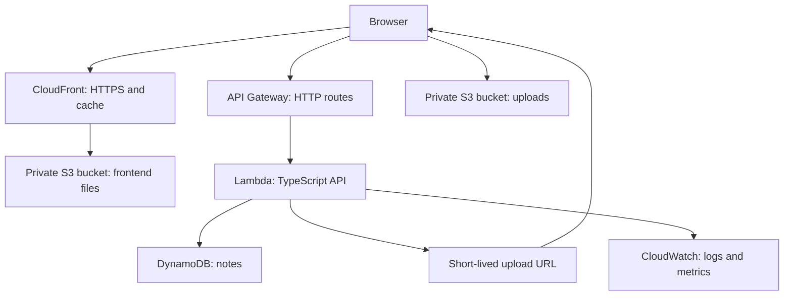

# AWS for Web Development: Revision and Hands-on Labs

[Back to the topic index](./README.md)

Build a small notes app with **React, TypeScript, pnpm, and AWS**. Learn each service by creating it, calling it, inspecting it, and deleting it.

**Documentation checked:** 1 October 2026. Examples use Node.js 24, AWS SDK for JavaScript v3, and AWS CDK v2. Install dependencies once and commit the generated lockfile to preserve your versions.

**Public repository:** all examples use generic names, dummy data, and placeholders. Keep real credentials, account details, deployment outputs, and local configuration out of Git.

## Contents

1. [AWS essentials](#1-aws-essentials)
2. [Ubuntu and AWS setup](#2-ubuntu-and-aws-setup)
3. [Create the project](#3-create-the-project)
4. [Write the Lambda API](#4-write-the-lambda-api)
5. [Define AWS infrastructure](#5-define-aws-infrastructure)
6. [Deploy and try the API](#6-deploy-and-try-the-api)
7. [Build the React frontend](#7-build-the-react-frontend)
8. [Host the frontend on AWS](#8-host-the-frontend-on-aws)
9. [Inspect logs and metrics](#9-inspect-logs-and-metrics)
10. [Optional: practise queues with SQS](#10-optional-practise-queues-with-sqs)
11. [Optional: GitHub Actions with OIDC](#11-optional-github-actions-with-oidc)
12. [Authentication, PostgreSQL, and Next.js](#12-authentication-postgresql-and-nextjs)
13. [Troubleshooting](#13-troubleshooting)
14. [Delete the lab resources](#14-delete-the-lab-resources)
15. [Revision questions and next exercises](#15-revision-questions-and-next-exercises)
16. [Official references](#16-official-references)

Work through sections 2–9 in order. Sections 10–12 are optional. Run project commands from `aws-web-lab/` unless stated otherwise. Paste each file snippet into the named file; terminal snippets are labelled `bash`.

## 1. AWS essentials

### Services to remember

| Service              | What it does                                      | Common web use                                      |
| -------------------- | ------------------------------------------------- | --------------------------------------------------- |
| IAM                  | Controls which identities can perform AWS actions | Give an API permission to access one table          |
| IAM Identity Center  | Gives people temporary access to AWS accounts     | Sign in to the CLI without permanent access keys    |
| S3                   | Stores objects in buckets                         | Uploads, images, and static build files             |
| CloudFront           | Caches and serves content through a CDN           | HTTPS delivery of a frontend                        |
| API Gateway          | Exposes HTTP endpoints                            | Route browser requests to Lambda                    |
| Lambda               | Runs code when invoked                            | APIs, scheduled jobs, and queue workers             |
| DynamoDB             | Stores items using keys and indexes               | Notes, sessions, and predictable key-based queries  |
| RDS / Aurora         | Runs managed relational databases                 | PostgreSQL for SQL, joins, transactions, and Prisma |
| Cognito              | Handles application user sign-in                  | Issue tokens for an authenticated API               |
| Secrets Manager      | Stores and rotates secrets                        | Database passwords and external API credentials     |
| CloudWatch           | Collects logs and operational metrics             | Debug requests and watch errors                     |
| CloudTrail           | Records AWS account activity                      | Investigate who changed infrastructure              |
| SQS                  | Buffers messages for workers                      | Process background jobs with retries                |
| EventBridge          | Routes events and schedules work                  | Run a job periodically or react to service events   |
| VPC                  | Defines a virtual network                         | Keep databases in private subnets                   |
| EC2 / ECS Fargate    | Runs virtual machines / containers                | Host a persistent Node.js or containerised service  |
| Route 53 / ACM       | Provides DNS / TLS certificates                   | Connect a domain and enable HTTPS                   |
| CDK / CloudFormation | Defines / provisions infrastructure as code       | Recreate environments from versioned code           |

### Vocabulary

| Term                   | Meaning                                                                   |
| ---------------------- | ------------------------------------------------------------------------- |
| Region                 | A geographical AWS deployment area; most lab resources live in one region |
| Availability Zone      | An isolated location within a region; use multiple zones for resilience   |
| ARN                    | A resource identifier used in permissions and configuration               |
| IAM role               | An identity assumed using temporary credentials                           |
| IAM policy             | Rules describing allowed or denied actions on resources                   |
| Execution role         | Permissions used by running application code, such as Lambda              |
| Deployment role        | Permissions used to create and update infrastructure                      |
| Infrastructure as code | Resource definitions stored alongside application code                    |
| Serverless             | AWS manages the servers; billing and operational work still exist         |

### What this lab creates



The browser sends file bytes directly to S3. Lambda creates the upload URL and stores notes; it does not proxy the file.

**Lab boundary:** the main API is publicly reachable and has no user authentication. Everyone can access the same demo notes and request upload URLs. Use dummy data, keep the deployment temporary, and delete it after practising. CORS controls browser access; it does not authenticate callers.

## 2. Ubuntu and AWS setup

### 2.1 Install local tools

```bash
sudo apt update
sudo apt install -y curl unzip jq git ca-certificates groff less
node --version
pnpm --version
```

Use **Node.js 24** and **pnpm 10.26 or newer**. Node.js 24 is supported by both CDK and Lambda. The pnpm minimum supports the build permission configuration used below.

If Node.js 24 is missing, install it with [nvm](https://github.com/nvm-sh/nvm). Skip the installer if nvm is already installed:

```bash
curl -fsSL https://raw.githubusercontent.com/nvm-sh/nvm/v0.40.8/install.sh \
  -o /tmp/aws-lab-install-nvm.sh
bash /tmp/aws-lab-install-nvm.sh
source "$HOME/.bashrc"
nvm install 24
nvm use 24
```

If pnpm is missing or outdated, follow its [installation instructions](https://pnpm.io/installation). All project dependency commands in this guide use pnpm.

### 2.2 Install AWS CLI v2

Skip this if `aws --version` already shows CLI v2. This uses AWS's installer, which verifies the download:

```bash
curl -fsSL https://awscli.amazonaws.com/v2/install.sh \
  -o /tmp/aws-lab-install-cli.sh
bash /tmp/aws-lab-install-cli.sh
export PATH="$HOME/.local/bin:$PATH"
aws --version
```

Add `$HOME/.local/bin` to your shell's PATH if it is not already present. The installer supports Linux x86-64 and ARM64.

### 2.3 Prepare an AWS learning account

1. Create or use a dedicated sandbox AWS account. Enable MFA on the root identity and use it only for account administration.
2. Set up an **IAM Identity Center organisation instance**, create a learning user, and assign that user access to the sandbox account. If prompted, create an AWS Organization. An account-only Identity Center instance does not provide these AWS account assignments.
3. For this disposable lab, the assigned permission set needs to create IAM roles and the services in the table above. `AdministratorAccess` in an isolated sandbox is a simple learning option; it is broad access, so use narrower deployment permissions for real projects.
4. Obtain the AWS access portal start URL and Identity Center region from that setup.
5. In **Billing → Budgets**, create a small monthly cost budget with notifications. Alerts are delayed notifications, not a spending cap. Do not assume Free Tier eligibility or zero charges.

The main lab creates no NAT gateway, load balancer, EC2 instance, or RDS database. Requests, storage, logs, CDN traffic, and optional resources can still incur charges.

### 2.4 Sign in with temporary credentials

```bash
aws configure sso --profile aws-lab
aws sso login --profile aws-lab

export AWS_PROFILE="aws-lab"
export AWS_REGION="us-east-1"
export AWS_DEFAULT_REGION="$AWS_REGION"
export AWS_PAGER=""

aws sts get-caller-identity
export AWS_ACCOUNT_ID="$(aws sts get-caller-identity --query Account --output text)"
```

In the wizard, use your actual portal URL and Identity Center region. Choose the sandbox account and permission set. The Identity Center region can differ from the region used for your app.

`AWS_PROFILE` selects your local login. `AWS_REGION` selects the app's deployment region; `us-east-1` is a generic example. `get-caller-identity` confirms which AWS identity will execute commands.

Repeat the exports in a new terminal. If existing `AWS_ACCESS_KEY_ID`, `AWS_SECRET_ACCESS_KEY`, or `AWS_SESSION_TOKEN` variables point to another identity, unset them before using this profile. Do not copy the identity command's account-specific output into a public README.

## 3. Create the project

### 3.1 Create folders and configuration

```bash
mkdir aws-web-lab
cd aws-web-lab
mkdir -p api infra .local
printf '24\n' > .nvmrc
```

Create `package.json`:

```json
{
  "name": "aws-web-lab",
  "private": true,
  "type": "commonjs",
  "engines": { "node": ">=24 <25" },
  "scripts": {
    "check": "tsc --noEmit",
    "cdk": "cdk",
    "synth": "cdk synth",
    "deploy": "cdk deploy AwsWebLab --outputs-file .local/outputs.json",
    "destroy": "cdk destroy AwsWebLab",
    "dev": "pnpm --dir web dev --host localhost --port 5173 --strictPort",
    "web:build": "pnpm --dir web build"
  }
}
```

Create `pnpm-workspace.yaml`:

```yaml
packages:
  - web
allowBuilds:
  esbuild: true
```

**What these do:** the root package owns infrastructure and backend dependencies. `web/` is a workspace package. The build permission lets esbuild install its binary without enabling scripts for every dependency.

Create `.gitignore`:

```gitignore
node_modules/
dist/
cdk.out/
.local/
.env
.env.*
!.env.example
cdk.context.json
*.pem
*.key
```

Create `tsconfig.json`:

```json
{
  "compilerOptions": {
    "target": "ES2022",
    "module": "Node16",
    "moduleResolution": "Node16",
    "strict": true,
    "esModuleInterop": true,
    "skipLibCheck": true,
    "noEmit": true,
    "types": ["node"]
  },
  "include": ["api/**/*.ts", "infra/**/*.ts"]
}
```

Create `cdk.json`:

```json
{
  "app": "pnpm exec tsx infra/app.ts"
}
```

**What these do:** TypeScript checks backend and infrastructure code. CDK runs `infra/app.ts` to produce a CloudFormation template. The React template has its own TypeScript configuration.

### 3.2 Install dependencies and scaffold React

```bash
pnpm add -w aws-cdk-lib constructs \
  @aws-sdk/client-dynamodb @aws-sdk/lib-dynamodb \
  @aws-sdk/client-s3 @aws-sdk/s3-request-presigner

pnpm add -Dw aws-cdk typescript tsx esbuild @types/node @types/aws-lambda

pnpm create vite@latest web --template react-ts --no-interactive
pnpm install
```

Record the installed pnpm version for repeatable CI:

```bash
node -e 'const fs = require("node:fs"); const p = JSON.parse(fs.readFileSync("package.json", "utf8")); p.packageManager = "pnpm@" + process.argv[1]; fs.writeFileSync("package.json", JSON.stringify(p, null, 2) + "\n");' "$(pnpm --version)"
```

**What these do:** CDK defines resources, tsx runs infrastructure TypeScript, esbuild packages Lambda, and SDK v3 clients call AWS services. Vite creates the React app. Commit `pnpm-lock.yaml`; later installs can use `pnpm install --frozen-lockfile`.

If pnpm reports other unreviewed dependency build scripts, inspect the named packages and use `pnpm approve-builds` to record an explicit allow/deny decision, then rerun installation. Commit the resulting workspace configuration so CI uses the same decisions.

| File or folder        | Purpose                                        |
| --------------------- | ---------------------------------------------- |
| `api/index.ts`        | Lambda request handler                         |
| `infra/app.ts`        | AWS resource definitions                       |
| `web/src/App.tsx`     | Browser UI                                     |
| `pnpm-lock.yaml`      | Exact dependency resolutions for the workspace |
| `.local/outputs.json` | Generated deployment details; ignored by Git   |
| `web/.env.local`      | Local frontend configuration; ignored by Git   |

## 4. Write the Lambda API

Create `api/index.ts`:

```ts
import { randomUUID } from "node:crypto";
import type { APIGatewayProxyEventV2 } from "aws-lambda";
import { DynamoDBClient } from "@aws-sdk/client-dynamodb";
import {
  DynamoDBDocumentClient,
  QueryCommand,
  PutCommand,
  DeleteCommand,
} from "@aws-sdk/lib-dynamodb";
import { S3Client, PutObjectCommand } from "@aws-sdk/client-s3";
import { getSignedUrl } from "@aws-sdk/s3-request-presigner";

function requiredEnv(name: string): string {
  const value = process.env[name];
  if (!value) throw new Error(`Missing environment variable: ${name}`);
  return value;
}

const tableName = requiredEnv("TABLE_NAME");
const uploadBucket = requiredEnv("UPLOAD_BUCKET");
const db = DynamoDBDocumentClient.from(new DynamoDBClient({}));
const s3 = new S3Client({ requestChecksumCalculation: "WHEN_REQUIRED" });
const partition = "DEMO";
const validId = /^\d{13}-[0-9a-f-]{36}$/i;

class HttpError extends Error {
  statusCode: number;
  constructor(statusCode: number, message: string) {
    super(message);
    this.statusCode = statusCode;
  }
}

function response(statusCode: number, data: unknown) {
  return {
    statusCode,
    headers: {
      "content-type": "application/json",
      "cache-control": "no-store",
    },
    body: JSON.stringify(data),
  };
}

function jsonBody(event: APIGatewayProxyEventV2): Record<string, unknown> {
  const text = event.isBase64Encoded
    ? Buffer.from(event.body ?? "", "base64").toString("utf8")
    : (event.body ?? "{}");
  if (Buffer.byteLength(text, "utf8") > 4096) {
    throw new HttpError(413, "JSON body is too large");
  }
  try {
    const value: unknown = JSON.parse(text);
    if (!value || typeof value !== "object" || Array.isArray(value)) {
      throw new Error("Expected an object");
    }
    return value as Record<string, unknown>;
  } catch {
    throw new HttpError(400, "Send a valid JSON object");
  }
}

export async function handler(event: APIGatewayProxyEventV2) {
  console.info(
    JSON.stringify({
      requestId: event.requestContext.requestId,
      route: event.routeKey,
    }),
  );

  try {
    switch (event.routeKey) {
      case "GET /health":
        return response(200, { ok: true });

      case "GET /notes": {
        const cursor = event.queryStringParameters?.cursor;
        if (cursor && !validId.test(cursor)) {
          throw new HttpError(400, "Invalid cursor");
        }
        const result = await db.send(
          new QueryCommand({
            TableName: tableName,
            KeyConditionExpression: "pk = :pk",
            ExpressionAttributeValues: { ":pk": partition },
            ScanIndexForward: false,
            ConsistentRead: true,
            Limit: 25,
            ExclusiveStartKey: cursor
              ? { pk: partition, sk: cursor }
              : undefined,
          }),
        );
        const items = (result.Items ?? []).map((item) => ({
          id: item.sk,
          title: item.title,
          createdAt: item.createdAt,
        }));
        return response(200, {
          items,
          nextCursor: result.LastEvaluatedKey?.sk ?? null,
        });
      }

      case "POST /notes": {
        const body = jsonBody(event);
        const title = typeof body.title === "string" ? body.title.trim() : "";
        if (!title || title.length > 120) {
          throw new HttpError(400, "Title must contain 1–120 characters");
        }
        const id = `${Date.now()}-${randomUUID()}`;
        const note = { id, title, createdAt: new Date().toISOString() };
        await db.send(
          new PutCommand({
            TableName: tableName,
            Item: { pk: partition, sk: id, title, createdAt: note.createdAt },
            ConditionExpression: "attribute_not_exists(pk)",
          }),
        );
        return response(201, note);
      }

      case "DELETE /notes/{id}": {
        const id = event.pathParameters?.id ?? "";
        if (!validId.test(id)) throw new HttpError(400, "Invalid note ID");
        const result = await db.send(
          new DeleteCommand({
            TableName: tableName,
            Key: { pk: partition, sk: id },
            ReturnValues: "ALL_OLD",
          }),
        );
        if (!result.Attributes) throw new HttpError(404, "Note not found");
        return response(200, { deleted: true });
      }

      case "POST /uploads": {
        const body = jsonBody(event);
        if (body.contentType !== "text/plain") {
          throw new HttpError(400, "This lab accepts text/plain uploads");
        }
        const key = `uploads/${randomUUID()}.txt`;
        const url = await getSignedUrl(
          s3,
          new PutObjectCommand({
            Bucket: uploadBucket,
            Key: key,
            ContentType: "text/plain",
          }),
          { expiresIn: 60 },
        );
        return response(200, { key, url });
      }

      default:
        return response(404, { message: "Route not found" });
    }
  } catch (error) {
    if (error instanceof HttpError) {
      return response(error.statusCode, { message: error.message });
    }
    console.error(
      JSON.stringify({
        requestId: event.requestContext.requestId,
        errorName: error instanceof Error ? error.name : "UnknownError",
      }),
    );
    return response(500, { message: "Internal server error" });
  }
}
```

### What the code does

| Part                               | Explanation                                                                                              |
| ---------------------------------- | -------------------------------------------------------------------------------------------------------- |
| SDK clients outside `handler`      | Reuses clients when Lambda reuses an execution environment                                               |
| No hard-coded credentials          | SDK uses Lambda's execution role in AWS                                                                  |
| `DynamoDBDocumentClient`           | Converts ordinary JavaScript objects to DynamoDB's value format                                          |
| `pk = DEMO`, `sk = timestamp-UUID` | Groups demo notes and lets queries return newer timestamp keys first                                     |
| `QueryCommand`                     | Reads one partition, instead of scanning the whole table                                                 |
| `LastEvaluatedKey` / cursor        | Fetches the next page; one query does not guarantee all results                                          |
| `ConsistentRead: true`             | Makes the lab's immediate refresh see completed table writes; costs more reads than eventual consistency |
| `PutCommand` with a condition      | Creates a note without overwriting an existing key                                                       |
| Input checks                       | Rejects malformed JSON, oversized JSON, and invalid titles                                               |
| `getSignedUrl`                     | Allows a specific S3 PUT for 60 seconds, subject to the signing credentials remaining valid              |
| `WHEN_REQUIRED`                    | Avoids adding an optional checksum for an unspecified upload body; mandatory checksums still apply       |
| Structured logs                    | Records a request ID and route without logging bodies or signed URLs                                     |

The shared partition is deliberately simple. A real multi-user app should derive partition keys from the **verified user identity** and enforce ownership. Timestamp keys do not guarantee an exact order between writes in the same millisecond.

The upload endpoint checks requested metadata; it does not inspect file contents or enforce a file-size limit. A presigned URL is a temporary bearer capability and can be reused until it expires. Authenticate requests before using this design beyond a disposable lab.

## 5. Define AWS infrastructure

Create `infra/app.ts`:

```ts
import * as path from "node:path";
import {
  App,
  Stack,
  Duration,
  RemovalPolicy,
  CfnOutput,
  Tags,
} from "aws-cdk-lib";
import * as dynamodb from "aws-cdk-lib/aws-dynamodb";
import * as s3 from "aws-cdk-lib/aws-s3";
import * as cloudfront from "aws-cdk-lib/aws-cloudfront";
import * as origins from "aws-cdk-lib/aws-cloudfront-origins";
import * as lambda from "aws-cdk-lib/aws-lambda";
import * as logs from "aws-cdk-lib/aws-logs";
import * as iam from "aws-cdk-lib/aws-iam";
import { NodejsFunction } from "aws-cdk-lib/aws-lambda-nodejs";
import {
  HttpApi,
  HttpStage,
  HttpMethod,
  CorsHttpMethod,
} from "aws-cdk-lib/aws-apigatewayv2";
import { HttpLambdaIntegration } from "aws-cdk-lib/aws-apigatewayv2-integrations";

const app = new App();
const stack = new Stack(app, "AwsWebLab", {
  env: {
    account: process.env.CDK_DEFAULT_ACCOUNT,
    region: process.env.CDK_DEFAULT_REGION,
  },
});
Tags.of(stack).add("Project", "aws-web-lab");

const siteBucket = new s3.Bucket(stack, "SiteBucket", {
  blockPublicAccess: s3.BlockPublicAccess.BLOCK_ALL,
  encryption: s3.BucketEncryption.S3_MANAGED,
  enforceSSL: true,
  removalPolicy: RemovalPolicy.DESTROY,
  autoDeleteObjects: true,
});

const distribution = new cloudfront.Distribution(stack, "SiteCDN", {
  defaultRootObject: "index.html",
  defaultBehavior: {
    origin: origins.S3BucketOrigin.withOriginAccessControl(siteBucket),
    viewerProtocolPolicy: cloudfront.ViewerProtocolPolicy.REDIRECT_TO_HTTPS,
    cachePolicy: cloudfront.CachePolicy.CACHING_OPTIMIZED,
    compress: true,
  },
});
const siteUrl = `https://${distribution.distributionDomainName}`;
const allowedOrigins = ["http://localhost:5173", siteUrl];

const uploadBucket = new s3.Bucket(stack, "UploadBucket", {
  blockPublicAccess: s3.BlockPublicAccess.BLOCK_ALL,
  encryption: s3.BucketEncryption.S3_MANAGED,
  enforceSSL: true,
  removalPolicy: RemovalPolicy.DESTROY,
  autoDeleteObjects: true,
  cors: [
    {
      allowedOrigins,
      allowedMethods: [s3.HttpMethods.PUT],
      allowedHeaders: ["content-type"],
      maxAge: 300,
    },
  ],
});

const table = new dynamodb.Table(stack, "NotesTable", {
  partitionKey: { name: "pk", type: dynamodb.AttributeType.STRING },
  sortKey: { name: "sk", type: dynamodb.AttributeType.STRING },
  billingMode: dynamodb.BillingMode.PAY_PER_REQUEST,
  removalPolicy: RemovalPolicy.DESTROY,
});

const logGroup = new logs.LogGroup(stack, "ApiLogs", {
  retention: logs.RetentionDays.ONE_WEEK,
  removalPolicy: RemovalPolicy.DESTROY,
});

const apiFunction = new NodejsFunction(stack, "ApiFunction", {
  entry: path.join(__dirname, "../api/index.ts"),
  handler: "handler",
  runtime: lambda.Runtime.NODEJS_24_X,
  memorySize: 256,
  timeout: Duration.seconds(10),
  depsLockFilePath: path.join(__dirname, "../pnpm-lock.yaml"),
  bundling: { minify: true, bundleAwsSDK: true },
  logGroup,
  environment: {
    TABLE_NAME: table.tableName,
    UPLOAD_BUCKET: uploadBucket.bucketName,
  },
});
table.grantReadWriteData(apiFunction);
uploadBucket.grantPut(apiFunction, "uploads/*");

const api = new HttpApi(stack, "Api", {
  createDefaultStage: false,
  corsPreflight: {
    allowOrigins: allowedOrigins,
    allowHeaders: ["content-type"],
    allowMethods: [
      CorsHttpMethod.GET,
      CorsHttpMethod.POST,
      CorsHttpMethod.DELETE,
      CorsHttpMethod.OPTIONS,
    ],
    maxAge: Duration.minutes(5),
  },
});
new HttpStage(stack, "DefaultStage", {
  httpApi: api,
  stageName: "$default",
  autoDeploy: true,
  throttle: { rateLimit: 2, burstLimit: 5 },
});
const integration = new HttpLambdaIntegration("LambdaIntegration", apiFunction);
api.addRoutes({ path: "/health", methods: [HttpMethod.GET], integration });
api.addRoutes({
  path: "/notes",
  methods: [HttpMethod.GET, HttpMethod.POST],
  integration,
});
api.addRoutes({
  path: "/notes/{id}",
  methods: [HttpMethod.DELETE],
  integration,
});
api.addRoutes({ path: "/uploads", methods: [HttpMethod.POST], integration });

new CfnOutput(stack, "ApiUrl", { value: api.apiEndpoint });
new CfnOutput(stack, "SiteUrl", { value: siteUrl });
new CfnOutput(stack, "SiteBucketName", { value: siteBucket.bucketName });
new CfnOutput(stack, "UploadBucketName", { value: uploadBucket.bucketName });
new CfnOutput(stack, "DistributionId", { value: distribution.distributionId });
new CfnOutput(stack, "TableName", { value: table.tableName });
new CfnOutput(stack, "FunctionName", { value: apiFunction.functionName });
new CfnOutput(stack, "LogGroupName", { value: logGroup.logGroupName });

// Optional GitHub OIDC role code from section 11 goes here.
```

### What the infrastructure does

| Definition                      | Explanation                                                                          |
| ------------------------------- | ------------------------------------------------------------------------------------ |
| Private site bucket + OAC       | CloudFront can read frontend files without making the bucket public                  |
| Separate upload bucket          | User uploads are isolated from publicly served frontend files                        |
| Bucket CORS                     | Allows browser PUT requests from the app's exact origins                             |
| HTTP API CORS                   | Allows browser API requests from the same origins                                    |
| `grantReadWriteData`            | Grants the Lambda role access to this table                                          |
| `grantPut(..., "uploads/*")`    | Limits Lambda's S3 permission to writes under that prefix                            |
| `bundleAwsSDK: true`            | Deploys your installed SDK version instead of depending on the runtime's SDK version |
| HTTP stage throttle             | Limits request throughput on a best-effort basis; it is not a spending cap           |
| One-week log retention          | Prevents logs from accumulating forever                                              |
| `CfnOutput`                     | Gives commands the generated names and URLs                                          |
| `DESTROY` + `autoDeleteObjects` | Makes lab cleanup delete stored data and bucket objects                              |

**Deletion behaviour:** these settings intentionally destroy demo data when the stack is deleted. For important data, choose retention, backups, and deletion protection appropriate to the project. CDK also creates small support resources for bucket cleanup and asset publishing.

**Networking:** this Lambda is outside a customer VPC. It can call DynamoDB and S3 without you provisioning NAT gateways. Add VPC networking when a dependency, such as a private PostgreSQL database, requires it.

## 6. Deploy and try the API

### 6.1 Check, bootstrap, and deploy

```bash
pnpm check
pnpm exec cdk bootstrap "aws://${AWS_ACCOUNT_ID}/${AWS_REGION}"
pnpm synth
pnpm exec cdk diff AwsWebLab
pnpm deploy
```

| Command         | What it does                                                                                         |
| --------------- | ---------------------------------------------------------------------------------------------------- |
| `pnpm check`    | Checks backend and infrastructure TypeScript                                                         |
| `cdk bootstrap` | Creates the asset bucket and roles needed in this account/region; normally done once per environment |
| `cdk synth`     | Generates the CloudFormation template and bundles Lambda locally                                     |
| `cdk diff`      | Shows the proposed infrastructure changes                                                            |
| `cdk deploy`    | Creates or updates AWS resources; review its IAM change prompt                                       |

CloudFront creation can take several minutes. The bootstrap stack is separate from `AwsWebLab` and is shared by later CDK projects in that environment.

### 6.2 Load generated resource names

```bash
export API_URL="$(jq -er '.AwsWebLab.ApiUrl' .local/outputs.json)"
export SITE_URL="$(jq -er '.AwsWebLab.SiteUrl' .local/outputs.json)"
export SITE_BUCKET="$(jq -er '.AwsWebLab.SiteBucketName' .local/outputs.json)"
export UPLOAD_BUCKET="$(jq -er '.AwsWebLab.UploadBucketName' .local/outputs.json)"
export DISTRIBUTION_ID="$(jq -er '.AwsWebLab.DistributionId' .local/outputs.json)"
export TABLE_NAME="$(jq -er '.AwsWebLab.TableName' .local/outputs.json)"
export FUNCTION_NAME="$(jq -er '.AwsWebLab.FunctionName' .local/outputs.json)"
export LOG_GROUP="$(jq -er '.AwsWebLab.LogGroupName' .local/outputs.json)"
```

Repeat these exports after redeploying or opening a new terminal. `jq -e` makes missing outputs visible as an error.

### 6.3 Call the API

Run commands individually so the small API throttle can refill:

```bash
curl -fsS "$API_URL/health" | jq

curl -fsS "$API_URL/notes" \
  -H 'content-type: application/json' \
  --data '{"title":"Learn Lambda and DynamoDB"}' \
  > .local/note.json
jq . .local/note.json

curl -fsS "$API_URL/notes" | jq

NOTE_ID="$(jq -er '.id' .local/note.json)"
curl -fsS -X DELETE "$API_URL/notes/$NOTE_ID" | jq
```

Expected: health returns `{"ok":true}`, creating a note returns an ID, listing returns `items`, and deleting returns `{"deleted":true}`.

Try invalid input:

```bash
curl -sS -i "$API_URL/notes" \
  -H 'content-type: application/json' \
  --data '{"title":""}'
```

Expected: **400**, with a validation message. `-i` displays HTTP headers and status; omitting `-f` lets you inspect the error response.

For pagination, create more than 25 notes, save a list response, then pass its non-null `nextCursor` as `?cursor=...`. The key schema keeps this cursor to a URL-safe string.

### 6.4 Upload a text file directly to private S3

```bash
printf 'Learning AWS uploads\n' > .local/sample.txt

curl -fsS "$API_URL/uploads" \
  -H 'content-type: application/json' \
  --data '{"contentType":"text/plain"}' \
  > .local/upload.json

SIGNED_URL="$(jq -er '.url' .local/upload.json)"
UPLOAD_KEY="$(jq -er '.key' .local/upload.json)"

curl -fsS -X PUT "$SIGNED_URL" \
  -H 'content-type: text/plain' \
  --data-binary @.local/sample.txt

aws s3 cp "s3://$UPLOAD_BUCKET/$UPLOAD_KEY" .local/downloaded.txt
diff .local/sample.txt .local/downloaded.txt
```

**What this does:** an API request obtains a signed PUT URL, `curl` uploads bytes to S3, and your authenticated CLI downloads them for comparison. Successful PUT often has an empty response body. Run the PUT within 60 seconds, or request a fresh URL.

The browser receives no AWS access keys. The bucket remains private; a normal unsigned object URL does not allow downloads. Do not publish signed URLs.

## 7. Build the React frontend

### 7.1 Configure the API endpoint

```bash
printf 'VITE_API_URL=%s\n' "$API_URL" > web/.env.local
```

Optionally commit `web/.env.example` containing only this placeholder:

```dotenv
VITE_API_URL=https://API_ID.execute-api.REGION.amazonaws.com
```

**What this does:** Vite exposes `VITE_` variables to browser code at build time. They are public configuration, so never put AWS keys, database passwords, or other secrets in them.

### 7.2 Replace `web/src/App.tsx`

```tsx
import { useCallback, useEffect, useState } from "react";
import "./App.css";

type Note = { id: string; title: string; createdAt: string };
type NotePage = { items: Note[]; nextCursor: string | null };
const baseUrl = String(import.meta.env.VITE_API_URL ?? "").replace(/\/$/, "");

function describe(error: unknown) {
  return error instanceof Error ? error.message : "Request failed";
}

async function request<T>(path: string, init: RequestInit = {}): Promise<T> {
  if (!baseUrl) throw new Error("Set VITE_API_URL and restart the dev server");
  const res = await fetch(`${baseUrl}${path}`, {
    ...init,
    headers: init.body ? { "content-type": "application/json" } : undefined,
  });
  const data = await res.json();
  if (!res.ok) throw new Error(data.message ?? `HTTP ${res.status}`);
  return data as T;
}

export default function App() {
  const [notes, setNotes] = useState<Note[]>([]);
  const [cursor, setCursor] = useState<string | null>(null);
  const [title, setTitle] = useState("");
  const [status, setStatus] = useState("");
  const [busy, setBusy] = useState(false);

  const loadPage = useCallback(async (after?: string, append = false) => {
    const path = after
      ? `/notes?cursor=${encodeURIComponent(after)}`
      : "/notes";
    const page = await request<NotePage>(path);
    setNotes((previous) =>
      append ? [...previous, ...page.items] : page.items,
    );
    setCursor(page.nextCursor);
  }, []);

  useEffect(() => {
    void loadPage().catch((error) => setStatus(describe(error)));
  }, [loadPage]);

  async function run(action: () => Promise<void>) {
    setBusy(true);
    setStatus("");
    try {
      await action();
    } catch (error) {
      setStatus(describe(error));
    } finally {
      setBusy(false);
    }
  }

  async function createNote() {
    await request<Note>("/notes", {
      method: "POST",
      body: JSON.stringify({ title }),
    });
    setTitle("");
    await loadPage();
    setStatus("Note saved");
  }

  async function deleteNote(id: string) {
    await request(`/notes/${encodeURIComponent(id)}`, { method: "DELETE" });
    await loadPage();
    setStatus("Note deleted");
  }

  async function uploadSample() {
    const signed = await request<{ key: string; url: string }>("/uploads", {
      method: "POST",
      body: JSON.stringify({ contentType: "text/plain" }),
    });
    const res = await fetch(signed.url, {
      method: "PUT",
      headers: { "content-type": "text/plain" },
      body: "Uploaded from the browser\n",
    });
    if (!res.ok) throw new Error(`Upload failed: HTTP ${res.status}`);
    setStatus(`Uploaded to private S3: ${signed.key}`);
  }

  return (
    <main>
      <h1>AWS Notes Lab</h1>
      <p>Demo data only. This API has no user authentication.</p>
      <form
        onSubmit={(event) => {
          event.preventDefault();
          void run(createNote);
        }}
      >
        <label htmlFor="title">Note title</label>
        <input
          id="title"
          value={title}
          maxLength={120}
          required
          onChange={(event) => setTitle(event.target.value)}
        />
        <button disabled={busy}>Save note</button>
      </form>
      <p role="status">{status}</p>
      <ul>
        {notes.map((note) => (
          <li key={note.id}>
            <span>{note.title}</span>
            <button
              disabled={busy}
              onClick={() => void run(() => deleteNote(note.id))}
            >
              Delete
            </button>
          </li>
        ))}
      </ul>
      {cursor && (
        <button
          disabled={busy}
          onClick={() => void run(() => loadPage(cursor, true))}
        >
          Load more
        </button>
      )}
      <button disabled={busy} onClick={() => void run(() => loadPage())}>
        Refresh
      </button>
      <button disabled={busy} onClick={() => void run(uploadSample)}>
        Upload sample text
      </button>
    </main>
  );
}
```

Replace `web/src/App.css`:

```css
main {
  max-width: 42rem;
  margin: 3rem auto;
  padding: 1rem;
  text-align: left;
}
form {
  display: flex;
  flex-wrap: wrap;
  align-items: center;
  gap: 0.75rem;
}
input {
  padding: 0.65rem;
  flex: 1;
  min-width: 12rem;
}
button {
  margin: 0.25rem;
}
li {
  display: flex;
  justify-content: space-between;
  align-items: center;
  gap: 1rem;
}
```

**What this does:** typed request helpers call the API, React state renders notes, the cursor loads another page, and a second fetch sends upload bytes directly to S3. Error responses become visible status messages.

### 7.3 Run locally

```bash
pnpm dev
```

Open **http://localhost:5173**. Save and delete a note, then upload the sample text. This is a local frontend connected to the deployed AWS API; it is not an offline AWS emulator.

Use browser developer tools → Network to inspect the POST, GET, DELETE, and S3 PUT requests. API and bucket CORS are separate configurations. Use `localhost`, rather than `127.0.0.1`, because origins must match exactly.

The template uses React Strict Mode, which may run the initial effect twice during development. Retry a refresh if the intentionally small API throttle returns 429.

## 8. Host the frontend on AWS

Stop the local dev server with Ctrl+C, or use a second terminal with the profile and output exports from sections 2 and 6.

```bash
pnpm web:build

aws s3 sync web/dist/ "s3://$SITE_BUCKET/" \
  --delete --cache-control 'no-cache'

INVALIDATION_ID="$(aws cloudfront create-invalidation \
  --distribution-id "$DISTRIBUTION_ID" \
  --paths '/*' --query 'Invalidation.Id' --output text)"

aws cloudfront wait invalidation-completed \
  --distribution-id "$DISTRIBUTION_ID" --id "$INVALIDATION_ID"

printf '%s\n' "$SITE_URL"
```

Open the displayed HTTPS URL and repeat the UI checks.

| Step           | What it does                                                                                                |
| -------------- | ----------------------------------------------------------------------------------------------------------- |
| Vite build     | Type-checks the scaffolded frontend and creates `web/dist/`                                                 |
| S3 sync        | Uploads the build and removes bucket files absent from the build; use it only on this dedicated site bucket |
| Cache metadata | Requests revalidation; CloudFront's managed policy still has a minimum TTL                                  |
| Invalidation   | Removes cached content so clients can see the new build                                                     |
| OAC            | Lets CloudFront fetch files from the private bucket                                                         |

For a production frontend, cache hashed JS/CSS assets for a long time and give HTML a short lifetime. Invalidation and cache headers solve different parts of cache freshness.

The app currently uses only `/`. Client-side routes such as `/notes/123` need a deliberate CloudFront rewrite or error-response fallback to `index.html`; S3 will otherwise look for that object. Do not apply an SPA fallback blindly to a multi-page Next.js export.

To change backend code, run `pnpm check`, `pnpm exec cdk diff AwsWebLab`, and `pnpm deploy` again. To change frontend code, rebuild, sync, and invalidate. If the API URL changes, regenerate `web/.env.local` before building.

## 9. Inspect logs and metrics

### 9.1 Follow Lambda logs

```bash
aws logs tail "$LOG_GROUP" --since 10m --follow
```

Call the API in another terminal. Match the request ID and route in the logs. Stop following with Ctrl+C.

CloudWatch **logs** explain an event; **metrics** show counts, durations, and trends. CloudTrail answers account-level questions about AWS API activity, such as who changed a resource.

### 9.2 Read recent Lambda error counts

```bash
aws cloudwatch get-metric-statistics \
  --namespace AWS/Lambda --metric-name Errors \
  --dimensions "Name=FunctionName,Value=$FUNCTION_NAME" \
  --start-time "$(date -u -d '1 hour ago' +%FT%TZ)" \
  --end-time "$(date -u +%FT%TZ)" \
  --period 300 --statistics Sum
```

**What this does:** fetches five-minute error totals for the last hour. Empty datapoints can mean no published data yet; metrics may take time to appear.

**Important distinction:** an HTTP 400, or even a caught error returned as HTTP 500, is a successful Lambda invocation from the platform's perspective. Lambda's `Errors` metric tracks invocation failures such as unhandled exceptions and timeouts. Also inspect API Gateway 4xx/5xx metrics and application logs for HTTP failures.

### 9.3 Create a simple alarm

```bash
aws cloudwatch put-metric-alarm \
  --alarm-name aws-web-lab-lambda-errors \
  --namespace AWS/Lambda --metric-name Errors \
  --dimensions "Name=FunctionName,Value=$FUNCTION_NAME" \
  --statistic Sum --period 60 --evaluation-periods 1 \
  --threshold 0 --comparison-operator GreaterThanThreshold \
  --treat-missing-data notBreaching
```

This creates an alarm when at least one invocation error occurs in a minute. It has no notification destination; view it in CloudWatch. Add an SNS alarm action separately if you want notifications. This alarm is created outside CDK and needs separate cleanup.

## 10. Optional: practise queues with SQS

**Goal:** see how an API can hand work to a worker, which processes it later. These CLI commands simulate producer and worker behaviour.

```bash
QUEUE_URL="$(aws sqs create-queue \
  --queue-name aws-web-lab-jobs \
  --attributes VisibilityTimeout=30,ReceiveMessageWaitTimeSeconds=10 \
  --query QueueUrl --output text)"

aws sqs send-message --queue-url "$QUEUE_URL" \
  --message-body '{"task":"process-demo-upload","key":"uploads/example.txt"}'

aws sqs receive-message --queue-url "$QUEUE_URL" \
  --max-number-of-messages 1 --wait-time-seconds 10 \
  > .local/message.json
jq '.Messages[0].Body' .local/message.json

RECEIPT="$(jq -er '.Messages[0].ReceiptHandle' .local/message.json)"
aws sqs delete-message --queue-url "$QUEUE_URL" --receipt-handle "$RECEIPT"
```

| Concept                | What to remember                                                                    |
| ---------------------- | ----------------------------------------------------------------------------------- |
| Long polling           | Waits briefly for work instead of repeatedly receiving empty responses              |
| Visibility timeout     | Temporarily hides a received message while a worker processes it                    |
| Delete message         | Acknowledges successful processing using the latest receipt handle                  |
| At-least-once delivery | Standard queue messages can be delivered more than once; workers must be idempotent |
| Dead-letter queue      | Stores repeatedly failing messages for investigation                                |

If no message arrives, repeat the receive command before extracting a receipt. To observe retries, receive a new message without deleting it, then receive again after the visibility timeout. In an app, attach Lambda to the queue using an event source mapping.

Clean up when done:

```bash
aws sqs delete-queue --queue-url "$QUEUE_URL"
```

## 11. Optional: GitHub Actions with OIDC

**Goal:** deploy from the repository's `main` branch using temporary credentials. GitHub exchanges its OIDC token for an AWS role session; you do not store permanent AWS access keys in GitHub.

Complete the manual deployment first. This section assumes the standard AWS partition, the default CDK bootstrap qualifier `hnb659fds`, and the same account/region as the lab. If you customised bootstrapping, adapt the role ARNs.

### 11.1 Register GitHub's OIDC provider once per account

Check whether it already exists:

```bash
aws iam get-open-id-connect-provider \
  --open-id-connect-provider-arn \
  "arn:aws:iam::${AWS_ACCOUNT_ID}:oidc-provider/token.actions.githubusercontent.com"
```

If the result is specifically `NoSuchEntity`, create it. If it exists, reuse it and check that `sts.amazonaws.com` is in its client ID list. Other failures, such as AccessDenied, need fixing before continuing.

```bash
aws iam create-open-id-connect-provider \
  --url https://token.actions.githubusercontent.com \
  --client-id-list sts.amazonaws.com
```

The current CLI can retrieve the certificate thumbprint when you omit it. An existing provider may be shared by other projects.

### 11.2 Add the optional role to `infra/app.ts`

Paste this at the marker at the end of the file. The `iam` import is already present:

```ts
const githubRepository: string | undefined =
  app.node.tryGetContext("githubRepository");
if (githubRepository) {
  if (!/^[A-Za-z0-9_.-]+\/[A-Za-z0-9_.-]+$/.test(githubRepository)) {
    throw new Error("githubRepository must be OWNER/REPOSITORY");
  }
  const providerArn = stack.formatArn({
    service: "iam",
    region: "",
    resource: "oidc-provider",
    resourceName: "token.actions.githubusercontent.com",
  });
  const role = new iam.Role(stack, "GitHubDeployRole", {
    assumedBy: new iam.FederatedPrincipal(
      providerArn,
      {
        StringEquals: {
          "token.actions.githubusercontent.com:aud": "sts.amazonaws.com",
          "token.actions.githubusercontent.com:sub": `repo:${githubRepository}:ref:refs/heads/main`,
        },
      },
      "sts:AssumeRoleWithWebIdentity",
    ),
  });

  // CDK assumes these bootstrap roles to publish assets and deploy the stack.
  const bootstrapRoles = ["deploy", "file-publishing", "lookup"].map((kind) =>
    stack.formatArn({
      service: "iam",
      region: "",
      resource: "role",
      resourceName: `cdk-hnb659fds-${kind}-role-${stack.account}-${stack.region}`,
    }),
  );
  role.addToPolicy(
    new iam.PolicyStatement({
      actions: ["sts:AssumeRole"],
      resources: bootstrapRoles,
    }),
  );
  siteBucket.grantReadWrite(role);
  role.addToPolicy(
    new iam.PolicyStatement({
      actions: ["cloudfront:CreateInvalidation"],
      resources: [
        stack.formatArn({
          service: "cloudfront",
          region: "",
          resource: "distribution",
          resourceName: distribution.distributionId,
        }),
      ],
    }),
  );
  new CfnOutput(stack, "GitHubRoleArn", { value: role.roleArn });
}
```

**What this does:** the trust policy accepts tokens for exactly one repository's `main` branch. The permissions policy allows CDK bootstrap role assumption, site uploads, and invalidation of this distribution.

CDK's default CloudFormation execution role has broad permissions. Therefore, access to the bootstrap deployment role is powerful even though this role's policy lists specific ARNs. Use this only in the sandbox; scope the execution role and protect the deployment branch for a real project.

Set the repository placeholder locally and deploy the role using your human AWS profile:

```bash
export GITHUB_REPOSITORY="OWNER/REPOSITORY"
pnpm check
pnpm exec cdk diff AwsWebLab -c "githubRepository=$GITHUB_REPOSITORY"
pnpm deploy -c "githubRepository=$GITHUB_REPOSITORY"
jq -r '.AwsWebLab.GitHubRoleArn' .local/outputs.json
```

Replace `OWNER/REPOSITORY` locally with the target repository. Once this optional role is enabled, pass the same `githubRepository` context on subsequent manual synth/diff/deploy commands; omitting it would remove the role from the template. The workflow below passes it automatically.

### 11.3 Set repository configuration

In GitHub → Settings → Secrets and variables → Actions:

| Setting        | Kind     | Value                                                                                              |
| -------------- | -------- | -------------------------------------------------------------------------------------------------- |
| `AWS_ROLE_ARN` | Secret   | The generated `GitHubRoleArn` output; using a secret keeps account details out of the example file |
| `AWS_REGION`   | Variable | The app's deployment region                                                                        |

Commit the root and web source files, `pnpm-workspace.yaml`, `package.json`, and the workspace's `pnpm-lock.yaml`. The `packageManager` field lets CI use the recorded pnpm version.

### 11.4 Create `.github/workflows/deploy.yml`

```yaml
name: Deploy AWS web lab
on:
  push:
    branches: [main]
  workflow_dispatch:

permissions:
  contents: read
  id-token: write

concurrency:
  group: aws-web-lab-deploy
  cancel-in-progress: false

jobs:
  deploy:
    if: github.ref == 'refs/heads/main'
    runs-on: ubuntu-latest
    env:
      AWS_REGION: ${{ vars.AWS_REGION }}
      AWS_PAGER: ""
    steps:
      - uses: actions/checkout@v7
        with:
          persist-credentials: false
      - uses: actions/setup-node@v7
        with:
          node-version: 24
          package-manager-cache: false
      - uses: pnpm/action-setup@v6
      - run: pnpm install --frozen-lockfile
      - run: pnpm check
      - uses: aws-actions/configure-aws-credentials@v6
        with:
          role-to-assume: ${{ secrets.AWS_ROLE_ARN }}
          aws-region: ${{ vars.AWS_REGION }}
          mask-aws-account-id: true
      - name: Deploy infrastructure and publish frontend
        shell: bash
        run: |
          set -euo pipefail
          mkdir -p .local
          pnpm exec cdk deploy AwsWebLab \
            -c "githubRepository=$GITHUB_REPOSITORY" \
            --require-approval never --outputs-file .local/outputs.json
          API_URL=$(jq -er '.AwsWebLab.ApiUrl' .local/outputs.json)
          SITE_BUCKET=$(jq -er '.AwsWebLab.SiteBucketName' .local/outputs.json)
          DISTRIBUTION_ID=$(jq -er '.AwsWebLab.DistributionId' .local/outputs.json)
          printf 'VITE_API_URL=%s\n' "$API_URL" > web/.env.local
          pnpm web:build
          aws s3 sync web/dist/ "s3://$SITE_BUCKET/" \
            --delete --cache-control 'no-cache'
          aws cloudfront create-invalidation \
            --distribution-id "$DISTRIBUTION_ID" --paths '/*'
```

**What this does:** installs locked dependencies, checks backend types, assumes the deployment role, deploys infrastructure, injects the public API URL into the frontend build, uploads it, and starts cache invalidation.

The workflow finishes after requesting invalidation; cache propagation continues afterwards. It uses major-version action tags for readability; pin reviewed commit SHAs for production supply-chain control.

`--require-approval never` enables unattended deployment after you have reviewed the configuration. Only trusted changes merged to `main` should reach this workflow. A separate pull-request workflow can type-check and build without AWS credentials. If you add a GitHub Environment later, its OIDC subject differs; update the trust condition accordingly.

## 12. Authentication, PostgreSQL, and Next.js

These are design notes and small recipes for the next iteration. The main lab does not provision Cognito, RDS, or a Next.js server.

### 12.1 Add real user authentication

Use a Cognito user pool and an application client without a browser-held client secret. A typical browser flow uses OAuth authorization code with PKCE. API Gateway's HTTP API JWT authorizer validates tokens before invoking Lambda.

After creating a user pool and app client, this is the CDK pattern to protect a route. Replace the generic config values with local configuration:

```ts
import { HttpJwtAuthorizer } from "aws-cdk-lib/aws-apigatewayv2-authorizers";

const authorizer = new HttpJwtAuthorizer(
  "UserJwt",
  "https://cognito-idp.REGION.amazonaws.com/USER_POOL_ID",
  { jwtAudience: ["APP_CLIENT_ID"] },
);

// In infra/app.ts, replace the existing /notes route registration.
api.addRoutes({
  path: "/notes",
  methods: [HttpMethod.GET, HttpMethod.POST],
  integration,
  authorizer,
  authorizationScopes: ["notes-api/read-write"],
});
```

**Prerequisites:** define a Cognito resource server with identifier `notes-api` and scope `read-write`; allow that scope on the app client; obtain an access token containing it through the OAuth flow. Protect DELETE and upload routes as well. Add `authorization` to API CORS headers and send `Authorization: Bearer <ACCESS_TOKEN>` from the frontend. This snippet is a pattern, not a complete login implementation.

For protected Lambda routes, change the handler's event type to `APIGatewayProxyEventV2WithJWTAuthorizer` from `aws-lambda` before reading `event.requestContext.authorizer.jwt.claims`. Validate that `sub` is a string, use that verified identity in the DynamoDB partition key, and check ownership on every read/write. If `/health` remains public, handle its unauthorised event shape separately. Decoding a JWT in the browser is not verification.

### 12.2 PostgreSQL and Prisma on AWS

| Requirement                                                 | Starting choice                                                                 |
| ----------------------------------------------------------- | ------------------------------------------------------------------------------- |
| SQL, joins, relational constraints, existing Prisma models  | RDS PostgreSQL or Aurora PostgreSQL                                             |
| Predictable partition/index reads with flexible item shapes | DynamoDB                                                                        |
| A persistent Node.js service with Prisma                    | ECS Fargate or another supported server runtime                                 |
| Lambda accessing private PostgreSQL                         | Lambda in the VPC, suitable network paths, and a connection management strategy |

For an RDS application:

1. Put the database in private subnets and allow its security group to accept port 5432 only from the application security group.
2. Store credentials in Secrets Manager, give the server permission to read that one secret, and inject/read the connection configuration on the server.
3. Use TLS according to the PostgreSQL driver and RDS certificate configuration. Keep certificate verification enabled.
4. Reuse a Prisma client per long-lived process or warm Lambda environment. Account for the total connections across all application instances.
5. Run migrations from a controlled job that can reach the private database, rather than on every request.

For an **existing Prisma project** with its configuration and schema already set up:

```bash
# DATABASE_URL must already be configured securely for this server-side job.
pnpm exec prisma migrate deploy
```

**What this does:** applies committed migrations to the target database. It does not create development migrations or provision RDS. A normal hosted GitHub runner does not automatically have network access to a private database.

RDS Proxy can help pool database connections, but check compatibility with your driver, ORM, and query behaviour. Adding Lambda to a public subnet does not give it public internet access; use appropriate NAT or VPC endpoints for required destinations. NAT gateways, database instances, proxies, and snapshots have separate costs and cleanup requirements.

### 12.3 Next.js deployment choices

| App behaviour                                     | AWS deployment option                                                                         |
| ------------------------------------------------- | --------------------------------------------------------------------------------------------- |
| Fully static export                               | S3 + CloudFront                                                                               |
| SSR, server actions, dynamic route handlers       | A compatible managed Next.js platform, such as Amplify Hosting, or a Node.js/container server |
| Containerised Next.js with infrastructure control | ECS Fargate; add load balancing, networking, and operational configuration                    |

In an existing Next.js app that supports static export, configure `next.config.ts`:

```ts
import type { NextConfig } from "next";

const nextConfig: NextConfig = {
  output: "export",
};

export default nextConfig;
```

```bash
pnpm build
```

**What this does:** writes an `out/` directory for static hosting. Dynamic server features are unavailable in this mode; dynamic routes must be generated at build time, and features such as the default image optimizer need another strategy. CloudFront must map route URLs to the exported files appropriately.

For SSR hosting, check the platform's current support for your exact Next.js version and features before deploying. S3 stores files; it does not run a Next.js server. `NEXT_PUBLIC_` values are browser-visible, just like Vite's `VITE_` values.

### 12.4 A custom domain

After the lab works with its generated domain:

1. Validate an ACM certificate for your chosen domain. CloudFront viewer certificates must be in `us-east-1`, even if the S3 origin is elsewhere.
2. Add the domain and certificate to the CloudFront distribution.
3. Create a Route 53 alias record, or the appropriate record with another DNS provider.
4. Add the new HTTPS origin to both API and upload-bucket CORS, then redeploy.

A domain registration and hosted zone can incur ongoing charges. They are outside the main lab's cleanup.

## 13. Troubleshooting

| Symptom                                 | Check                                                                                                    |
| --------------------------------------- | -------------------------------------------------------------------------------------------------------- |
| ExpiredToken or SSO session expired     | Run `aws sso login --profile aws-lab` again                                                              |
| Commands target the wrong account       | Check profile, environment credentials, region, and `aws sts get-caller-identity`                        |
| Bootstrap access denied                 | Check sandbox deployment permissions, including IAM; do not bootstrap through the root identity          |
| esbuild or build-script problem         | Check `allowBuilds`, pnpm version, and run `pnpm rebuild esbuild`                                        |
| CDK cannot find a lockfile              | Run dependency installation from the project root; keep `pnpm-lock.yaml` beside `package.json`           |
| CDK cloud assembly schema mismatch      | Update the project's `aws-cdk` CLI and `aws-cdk-lib` together, then regenerate and commit the lockfile   |
| API GET 404                             | Use the output API endpoint with `/health` or `/notes`; the `$default` stage needs no extra stage prefix |
| Browser fails but curl works            | Inspect browser CORS errors and exact origin, method, and headers                                        |
| Browser S3 upload fails                 | Check bucket CORS separately, URL expiry, matching PUT method, and content type                          |
| 429 Too Many Requests                   | Retry more slowly; the lab's HTTP API throttle is intentionally small                                    |
| CloudFront 403 before first upload      | Build and sync the frontend; the bucket initially has no `index.html`                                    |
| CloudFront 403 after upload             | Check OAC, bucket policy, object key, and cached errors; invalidate and retry                            |
| Old frontend appears                    | Check build output, API URL at build time, invalidation status, and browser cache                        |
| Refreshing a client-side route fails    | Configure routing fallback or rewrite rules for the chosen frontend type                                 |
| Notes are missing after one query       | Follow `nextCursor`; query results are paginated                                                         |
| Lambda access denied on AWS services    | Inspect its execution role and target resource ARN; your CLI identity is a different role                |
| OIDC cannot assume role                 | Check repository/branch subject, audience, provider, and `id-token: write`                               |
| CI cannot assume CDK bootstrap roles    | Check qualifier, account, region, trust, and the role's `sts:AssumeRole` permissions                     |
| Private PostgreSQL connection times out | Check VPC routes and security groups before changing database passwords                                  |

## 14. Delete the lab resources

If you enabled GitHub deployment, **disable the workflow first** so a later push does not recreate resources. Use your human sandbox profile for cleanup.

### 14.1 Delete resources created outside CDK

Delete the optional CloudWatch alarm if you created it:

```bash
aws cloudwatch delete-alarms --alarm-names aws-web-lab-lambda-errors
```

If you have not already deleted the optional SQS queue:

```bash
aws sqs delete-queue --queue-url "$QUEUE_URL"
```

If you lost `QUEUE_URL`, retrieve it first with `aws sqs get-queue-url --queue-name aws-web-lab-jobs --query QueueUrl --output text`.

### 14.2 Destroy the application stack

```bash
pnpm destroy
```

Review the deletion prompt. The stack deletes the API, Lambda, table, log group, CDN, buckets and their objects, and the optional GitHub role if present in the deployed stack. CloudFront deletion can take time. Context is not required for this destroy command because it deletes the existing named CloudFormation stack.

Verify the app stack is gone:

```bash
aws cloudformation describe-stacks --stack-name AwsWebLab
```

Expected: a stack-not-found validation error after deletion completes. If deletion fails, inspect CloudFormation events and resolve the named resource before retrying.

### 14.3 Review remaining shared resources

| Resource                            | Cleanup decision                                                                                      |
| ----------------------------------- | ----------------------------------------------------------------------------------------------------- |
| `CDKToolkit` bootstrap stack        | Usually retain for more CDK work; it contains asset storage and roles and is not removed with the app |
| GitHub OIDC provider                | Retain if shared; delete only if this lab created it and no other role uses it                        |
| Account budget and notifications    | Usually retain for future learning                                                                    |
| Any resources created in section 12 | Delete separately using their own deployment and retention settings                                   |

Bootstrap assets can accumulate storage charges. In an account/region dedicated only to this exercise, inspect and empty the bootstrap asset bucket, and delete `CDKToolkit` only after checking that no other CDK stack depends on it. Do not run broad bucket-deletion commands against a shared environment.

If the GitHub provider was created exclusively for this lab and is unused after role deletion:

```bash
aws iam delete-open-id-connect-provider \
  --open-id-connect-provider-arn \
  "arn:aws:iam::${AWS_ACCOUNT_ID}:oidc-provider/token.actions.githubusercontent.com"
```

Remove the lab's `AWS_ROLE_ARN` GitHub secret when no longer needed. Check Billing/Cost Explorer later because usage reporting is delayed.

## 15. Revision questions and next exercises

### Questions to answer from memory

1. Which role does Lambda use to call DynamoDB? Which identity deploys the infrastructure?
2. Why does the React app contain no AWS access keys?
3. Why can a private S3 bucket still serve a public website through CloudFront?
4. Why does a successful curl request not prove browser CORS is correct?
5. When should you choose PostgreSQL instead of DynamoDB?
6. What is the difference between `Query` and `Scan`? Why must you handle pagination?
7. Does returning HTTP 500 necessarily increment Lambda's `Errors` metric?
8. Why can an SQS worker receive the same job again?
9. Which Next.js features require a server rather than a static export?
10. What remains after `cdk destroy`? Does an AWS budget stop all spending?

<details>
<summary>Check your answers</summary>

1. Lambda uses its execution role. Local deployment uses the signed-in profile and CDK roles; CI assumes the GitHub deployment role and bootstrap roles.
2. The browser calls your API or uses a narrowly scoped presigned URL. Service credentials stay in server-side roles.
3. CloudFront's OAC permits the distribution to read the private origin, and the distribution serves viewers.
4. curl does not enforce browser CORS. Browsers inspect origin permissions and may send preflight requests.
5. Choose PostgreSQL when relational queries, joins, constraints, transactions, and an existing SQL/Prisma model fit the workload.
6. Query reads by partition key and optional sort-key conditions; Scan examines a table or index. Both can return partial pages.
7. No. A caught failure returned as a response is not an invocation failure; inspect API metrics and application logs too.
8. Standard queues provide at-least-once delivery, and messages return after a visibility timeout unless successfully deleted.
9. Features requiring request-time server execution, such as SSR, server actions, and dynamic server handlers.
10. Separately created and shared resources, such as the bootstrap stack or an OIDC provider, can remain. A budget alert is not a hard cap.

</details>

### Learn by changing one thing at a time

- [ ] Build and deploy the main lab, then delete it and recreate it from code.
- [ ] Add `PATCH /notes/{id}` with `UpdateCommand`, validation, and a matching frontend action.
- [ ] Create more than 25 notes and verify the frontend's next-page behaviour.
- [ ] Change the allowed browser origin and observe how preflight requests fail.
- [ ] Remove Lambda's table permission, deploy, observe the logged failure, then restore it.
- [ ] Add Cognito sign-in and protect all data/upload routes; derive keys from verified user claims.
- [ ] Replace PUT signing with a presigned POST policy that limits upload size; validate actual file content before publishing it.
- [ ] Add a queue worker with idempotent processing, a dead-letter queue, and partial batch failure handling.
- [ ] Add alarms for API 5xx responses and latency, with a notification destination.
- [ ] Add a separate CI job that checks and builds pull requests without cloud credentials.
- [ ] Try PostgreSQL with an existing Prisma app and document network/connection requirements.
- [ ] Review `cdk diff` before each change and remove resources when finished.

## 16. Official references

Use these when revising, changing versions, or adapting the lab. This guide explains a learning project; service limits, pricing, and runtime/platform support should be rechecked for an actual deployment.

| Topic                      | Primary documentation                                                                                                                                                                                                                                                                                                                                                          |
| -------------------------- | ------------------------------------------------------------------------------------------------------------------------------------------------------------------------------------------------------------------------------------------------------------------------------------------------------------------------------------------------------------------------------ |
| CLI installation and login | [AWS CLI v2 installation](https://docs.aws.amazon.com/cli/latest/userguide/getting-started-install.html), [Identity Center profiles](https://docs.aws.amazon.com/cli/latest/userguide/cli-configure-sso.html), [Identity Center instance types](https://docs.aws.amazon.com/singlesignon/latest/userguide/identity-center-instances.html)                                      |
| Identity and cost controls | [IAM best practices](https://docs.aws.amazon.com/IAM/latest/UserGuide/best-practices.html), [AWS Budgets](https://docs.aws.amazon.com/cost-management/latest/userguide/budgets-managing-costs.html)                                                                                                                                                                            |
| Node and pnpm              | [nvm](https://github.com/nvm-sh/nvm), [pnpm installation](https://pnpm.io/installation), [pnpm build settings](https://pnpm.io/settings/build)                                                                                                                                                                                                                                 |
| CDK and runtimes           | [CDK Node versions](https://docs.aws.amazon.com/cdk/v2/guide/node-versions.html), [CDK bootstrapping](https://docs.aws.amazon.com/cdk/v2/guide/bootstrapping-env.html), [NodejsFunction bundling](https://docs.aws.amazon.com/cdk/api/v2/docs/aws-cdk-lib.aws_lambda_nodejs-readme.html), [Lambda runtimes](https://docs.aws.amazon.com/lambda/latest/dg/lambda-runtimes.html) |
| SDK credentials            | [AWS SDK v3 Node.js credentials](https://docs.aws.amazon.com/sdk-for-javascript/v3/developer-guide/setting-credentials-node.html)                                                                                                                                                                                                                                              |
| API Gateway                | [HTTP API CDK constructs](https://docs.aws.amazon.com/cdk/api/v2/docs/aws-cdk-lib.aws_apigatewayv2-readme.html), [HTTP API CORS](https://docs.aws.amazon.com/apigateway/latest/developerguide/http-api-cors.html), [JWT authorizers](https://docs.aws.amazon.com/apigateway/latest/developerguide/http-api-jwt-authorizer.html)                                                |
| DynamoDB                   | [Query pagination](https://docs.aws.amazon.com/amazondynamodb/latest/developerguide/Query.Pagination.html)                                                                                                                                                                                                                                                                     |
| S3 uploads                 | [Presigned upload URLs](https://docs.aws.amazon.com/AmazonS3/latest/userguide/PresignedUrlUploadObject.html), [SDK checksums](https://docs.aws.amazon.com/sdk-for-javascript/v3/developer-guide/s3-checksums.html), [Checksum settings](https://docs.aws.amazon.com/sdkref/latest/guide/feature-dataintegrity.html)                                                            |
| CloudFront                 | [S3 origin access control in CDK](https://docs.aws.amazon.com/cdk/api/v2/docs/aws-cdk-lib.aws_cloudfront_origins.S3BucketOrigin.html), [Invalidations](https://docs.aws.amazon.com/AmazonCloudFront/latest/DeveloperGuide/Invalidation.html), [TLS certificates](https://docs.aws.amazon.com/AmazonCloudFront/latest/DeveloperGuide/cnames-and-https-requirements.html)        |
| Monitoring                 | [Lambda metric definitions](https://docs.aws.amazon.com/lambda/latest/dg/monitoring-metrics-types.html)                                                                                                                                                                                                                                                                        |
| SQS                        | [Receiving and deleting messages](https://docs.aws.amazon.com/AWSSimpleQueueService/latest/SQSDeveloperGuide/step-receive-delete-message.html)                                                                                                                                                                                                                                 |
| GitHub OIDC                | [AWS OIDC trust policies](https://docs.aws.amazon.com/IAM/latest/UserGuide/id_roles_create_for-idp_oidc.html), [Create OIDC provider](https://docs.aws.amazon.com/cli/latest/reference/iam/create-open-id-connect-provider.html), [AWS credentials action](https://github.com/aws-actions/configure-aws-credentials)                                                           |
| Workflow actions           | [checkout](https://github.com/actions/checkout), [setup-node](https://github.com/actions/setup-node), [pnpm action](https://github.com/pnpm/action-setup)                                                                                                                                                                                                                      |
| React build setup          | [Vite guide](https://vite.dev/guide/)                                                                                                                                                                                                                                                                                                                                          |
| PostgreSQL networking      | [Lambda VPC internet access](https://docs.aws.amazon.com/lambda/latest/dg/configuration-vpc-internet.html), [RDS Proxy](https://docs.aws.amazon.com/AmazonRDS/latest/UserGuide/rds-proxy.html)                                                                                                                                                                                 |
| Next.js                    | [Static exports](https://nextjs.org/docs/app/guides/static-exports), [Amplify Next.js support](https://docs.aws.amazon.com/amplify/latest/userguide/ssr-amplify-support.html)                                                                                                                                                                                                  |

**Validation note:** shell syntax, JSON/YAML syntax, TypeScript/TSX syntax, internal links, and output references were checked. The handler's validation, CRUD, pagination, and error paths passed local checks with mocked AWS calls. Dependencies were not installed for a full type-check/build, and the project was not deployed to AWS; run the listed type checks, review CDK changes, and verify the expected responses in your own sandbox.
