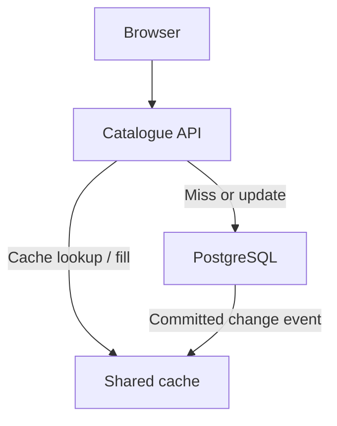
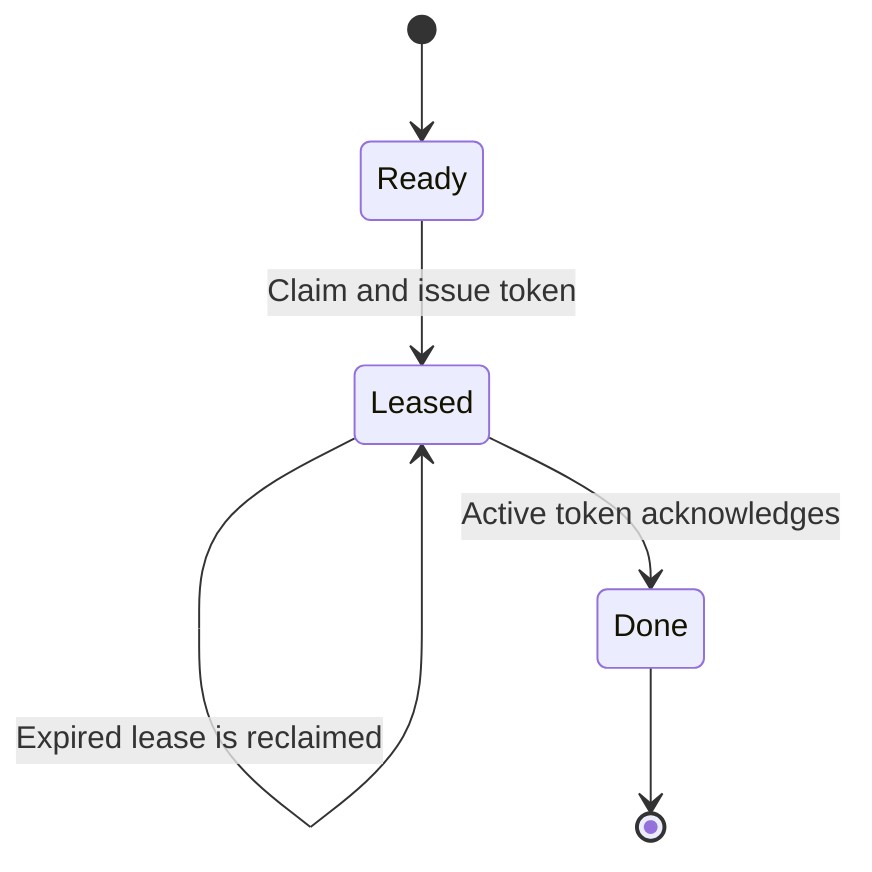

# Practical system-design exercises

[Back to the topic index](./README.md)

[Runnable labs](../../practice/system-design/README.md)

Design a small correct system first, then introduce load and failures. These exercises use a generic catalogue/reservation/export service and fictional workloads. Use Node.js/TypeScript and PostgreSQL in your design if helpful; explain what each component is needed for before adding it.

## A repeatable design method

1. **Clarify:** users, operations, exclusions, correctness rules, acceptable latency/staleness, and load.
2. **Estimate:** average/peak requests, storage, payload size, and the likely bottleneck; show units and assumptions.
3. **Sketch:** API, schema, components, and one read/write flow.
4. **Break:** timeouts, duplicate requests, concurrent writes, crashes, dependency failures, and recovery.
5. **Review:** justify one tradeoff, name one rejected option, and define measurable signals.

For each exercise produce: a component diagram, two API examples, a data model with keys/indexes, a failure table, and a short decision record. Keep the fictional design public; keep actual employment stories and identifiers in a separate private practice log.

Budget 35–45 minutes for a design attempt, then use the lab to test one assumption. The JavaScript labs are single-process models; production durability and coordination require the database/broker mechanisms discussed below.

## Exercise 1: a read-heavy catalogue

**Prompt:** design a service that returns item descriptions and display prices. Editors update items. Users can browse slightly stale data, but checkout must validate the authoritative price and inventory. Exclude recommendations and full-text search from the first design.

| Requirement      | Fictional target                                        |
| ---------------- | ------------------------------------------------------- |
| Reads            | 100 million/day; peak = 10 × average                    |
| Updates          | 100,000/day                                             |
| Items            | 1 million; 2 KB average stored document                 |
| Browse latency   | p95 below 200 ms                                        |
| Browse staleness | Define and defend a target of at most 5 seconds         |
| Correctness      | Cached display data must not authorise a purchase price |

**Estimate first:** 100,000,000 / 86,400 ≈ 1,157 average reads/s and 11,574 peak reads/s. At a hypothetical 95% hit rate, average database reads are about 58/s and peak about 579/s, before stampedes, retries, or correlated misses. Raw documents occupy about 2 GB using decimal KB, excluding indexes, replicas, and overhead. These are workload assumptions, not a capacity guarantee.

**Starting design:** `GET /items/:id`, `PATCH /items/:id`, a `catalog_items(id PRIMARY KEY, version, description, display_price, updated_at)` table, and a cache keyed by item ID. Authenticate/authorise editing. Use exact monetary units or PostgreSQL `numeric`, rather than binary floating-point for final charges.

The event arrow is a proposed invalidation mechanism, not something PostgreSQL automatically sends to a cache. Explain how a durable outbox/consumer would implement it if the design needs reliable delivery.

**Hands-on:** run `pnpm run lab cache` in [practice/system-design](../../practice/system-design/README.md). Compare stale reads without invalidation, refresh at the TTL boundary, and delete-on-write behaviour. Change the TTL and add a test for repeated hot-key reads.

**Failure drill:** interleave these events on paper: reader misses → reads old DB value → writer commits a new value and deletes cache → reader fills cache with the old value. Delete-on-write alone loses this race. Also ask what happens if the writer crashes after committing but before invalidating. The synchronous local model cannot reproduce those interleavings.

**Review criteria:**

- Explain the hit path and miss path, and decide whether a cache failure falls back to the database with limits.
- Distinguish TTL from a hard end-to-end freshness guarantee; delayed reads/invalidation can extend staleness.
- Propose version checks, carefully ordered invalidation, or a durable event/version mechanism, and explain its remaining race cases.
- Handle stampedes with per-key request coalescing and consider TTL jitter; do not assume one process's lock coordinates all API instances.
- Measure hit rate, origin query latency, p95/p99 API latency, and invalidation lag. Define how you would detect stale versions.

Reference direction after your attempt

Start with one API and indexed PostgreSQL reads; add a shared cache only when measurements justify it. Cache-aside with TTL is a useful baseline for browsable data. Invalidate after commit and define recovery for lost invalidations, but acknowledge the stale-fill race. A strict freshness target may need coherent versioning or authoritative reads; shorter TTL by itself is not a proof. At checkout, read authoritative price/inventory rather than trusting the browser or browse cache.

## Exercise 2: reservations with safe retries

**Prompt:** two clients try to reserve the last unit while one client's successful response is lost and retried. Prevent overselling and prevent a retry from creating a second reservation. Exclude real payment processing; describe where it would become a separate workflow.

**API:** `POST /reservations` with an `Idempotency-Key` header and body `{ "sku": "widget", "quantity": 1 }`. Return `201` with a reservation ID, `409` for insufficient stock, or a conflict for the same key with a different payload. Scope keys to an authenticated client/account and operation in a real service. The local model has one synthetic client scope.

**Data model:**

| Table               | Keys and important fields                                                                            |
| ------------------- | ---------------------------------------------------------------------------------------------------- |
| Inventory           | `sku` primary key; non-negative `available`                                                          |
| Reservations        | Reservation ID primary key; SKU, quantity, state, expiry                                             |
| Idempotency records | Unique `(client_id, operation, key)`; canonical request fingerprint; status/body; retention deadline |

**Hands-on A:** run `pnpm run lab idempotency`. The first call reserves two units; the same-key retry returns the same response and does not reduce stock again. Change the quantity with the same key and explain why replaying the original response would be incorrect. Then retry with a new key and observe a new intent.

**Hands-on B:** use the optional [two-terminal PostgreSQL exercise](../../practice/system-design/README.md#optional-postgresql-contention-lab). One conditional update reserves the last item, while the competing transaction waits and then updates zero rows. Repeat with the first transaction rolled back.

**Transaction design:**

1. Begin a database transaction and attempt to insert the unique idempotency record.
2. If another transaction owns that key, wait for its result, then read it in a new statement under Read Committed. Verify the request fingerprint and replay the stored response. A key conflict with different intent fails.
3. If this transaction claimed the key, conditionally decrement inventory only when enough stock exists; create the reservation when it succeeds.
4. Store the complete response for the key and commit **the inventory effect, reservation, and response together**. Cache business failures according to an explicit API policy; the lab replays them too.
5. Respond only after commit. On a lost response, retry with the same key. On a pre-commit crash, rollback leaves no successful effect to replay.

This is a flow to implement, not a ready-made SQL procedure. The runnable inventory SQL verifies the stock race only; it does not implement durable idempotency records. A separate in-memory Map on each API server cannot coordinate retries across instances or survive a restart.

**Failure table to complete:**

| Event                               | Required outcome / question                                                         |
| ----------------------------------- | ----------------------------------------------------------------------------------- |
| Two requests for one remaining item | Exactly one reservation succeeds; stock never goes negative                         |
| Response lost after commit          | Retry replays the committed result                                                  |
| Crash before commit                 | Effect and key record roll back together                                            |
| Same key, different payload         | Conflict; no additional inventory change                                            |
| Key expires before a late retry     | Define retention and client retry deadlines; avoid silently repeating an old effect |
| Multi-item reservation              | Use one transaction and consistent lock order; handle deadlocks/retries             |

**Review criteria:** distinguish an atomic conditional update from idempotency; identify the unique constraint and transaction boundary; store a response rather than merely “already done”; define reservation expiry and recovery metrics. Measure conflict rates, retry/replay counts, lock waits, and expired reservations.

Reference direction after your attempt

A conditional `UPDATE ... WHERE available >= quantity RETURNING ...` solves the single-row stock race under the described isolation level. A unique request key and fingerprint solve repeated intent only when recording the result is atomic with the effect. Retention is part of the API contract. Do not retry a charge with a new identity after a timeout; a payment integration would need the provider's idempotency/reconciliation semantics and a durable workflow.

## Exercise 3: recoverable background jobs

**Prompt:** an API records a request for an export and returns `202`. A worker generates it and sends a completion event. The worker can crash at any point, including after delivering the event but before acknowledging the job. Handle retries without treating each attempt as a new logical event.

**Fictional load:** 10,000 jobs/day, 5 seconds average processing time, 10 × peak factor. Average arrival rate ≈ 0.116 jobs/s; at peak ≈ 1.16 jobs/s. At a target 70% worker utilisation, a simplified estimate is `ceil(1.16 × 5 / 0.70) = 9` worker slots. Validate actual service-time variation, downstream limits, and backlog-drain requirements before relying on this estimate.

**API:** `POST /exports -> 202 { "jobId": "job-1" }` and `GET /exports/:jobId -> state/result`. Authorise access to the result. Use bounded signed download access and expire outputs if object storage is introduced.

**Data model:** job ID, payload/reference, state, attempt count, next eligible time, lease deadline/token, result reference, and last error. Store an outbox event in the same transaction as a business write when the write must reliably trigger a job. A relay publishes it and may publish more than once, so the consumer still needs deduplication.

**Hands-on:** run `pnpm run lab jobs`. The first worker performs an effect and crashes before acknowledgement. Advance the clock; the second worker receives a new token. The sink deduplicates by stable job ID, and the old worker's token cannot acknowledge the new lease. Change the sink key to include the attempt number; explain why duplicates return.

Use the optional [PostgreSQL worker lab](../../practice/system-design/README.md#optional-postgresql-worker-lab) to claim with `FOR UPDATE SKIP LOCKED`, release row locks quickly, and acknowledge only a matching unexpired lease. With more sample jobs, examine a query plan and indexes for ready jobs versus expired leases.

**Failure drill:** distinguish claim, durable processing state, external side effect, and acknowledgement. A durable dedupe record written before an external call can suppress a call that never happened; written after it can allow duplicates after a crash. The sink's synchronous in-memory operation does not solve that distributed atomicity problem. Use a provider-supported stable idempotency key, a transaction that includes the effect when possible, or a reconciliation strategy.

**Review criteria:**

- State **at-least-once delivery** and explain the duplicate window; do not promise “exactly once” because a queue exists.
- Add bounded retries, exponential backoff with jitter, a dead-letter state, and a deliberate replay process.
- Explain lease renewal for long jobs, ownership tokens, and why stale workers must not overwrite newer results.
- Keep external work outside a long database transaction. Tokens/leases alone do not fence external side effects.
- Define ordering requirements explicitly; `SKIP LOCKED` may process a later job first.
- Measure oldest ready-job age, queue depth, completion/error rates, lease expiries, attempts, and deduped effects.

Reference direction after your attempt

Begin with a durable PostgreSQL job table for a small service if its load is adequate. Claim in a short transaction, process after commit, and acknowledge conditionally on lease token/expiry. Use a stable logical effect key across retries. Introduce a broker when routing, throughput, or operational requirements justify it; an outbox prevents the database/broker dual-write gap but does not remove duplicates. Treat lease renewal and bounded recovery as necessary design work beyond the small lab.

## Review your design aloud

Give a two-minute explanation: requirement → bottleneck → component → failure → recovery. Defend one simpler alternative. Rework a case after changing one constraint: strict freshness, multi-region writes, ten times the load, or a provider without idempotency support. State which part of your previous correctness argument stops applying.

## Primary references

- [AWS Builders' Library: making retries safe with idempotent APIs](https://aws.amazon.com/builders-library/making-retries-safe-with-idempotent-APIs/)
- [PostgreSQL: transaction isolation and Read Committed updates](https://www.postgresql.org/docs/current/transaction-iso.html)
- [PostgreSQL: SELECT, row locks, and SKIP LOCKED](https://www.postgresql.org/docs/current/sql-select.html)

[Back to system design](./README.md)
